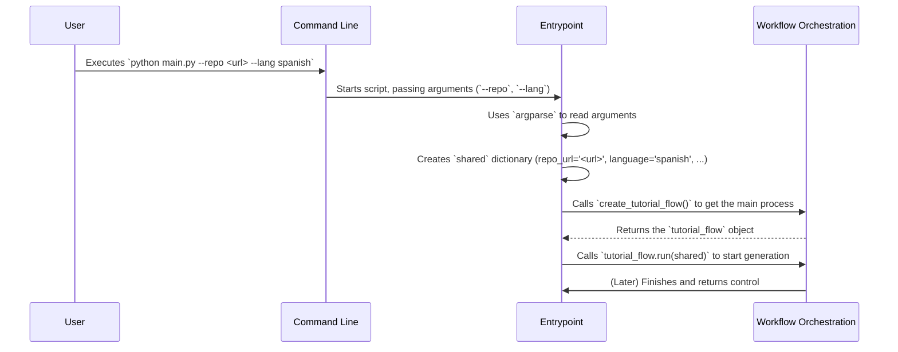

# Chapter 1: Configuration & Execution Entrypoint

Welcome to the PocketFlow Tutorial Codebase Knowledge project! This tutorial will guide you through the different parts of the code that automatically generate tutorials for software projects.

Imagine you want to create a tutorial for your cool new project hosted on GitHub. How do you tell our tool *which* project to look at? What if the project is on your computer instead? What language should the tutorial be in? This first chapter explains the "front door" of our application – how it takes your instructions and gets ready to work.

Think of this part like the **control panel** or the **ignition switch** of a car. You put the key in (provide the project details), maybe adjust the mirrors (set some options like language), and then turn the key (start the process). This chapter focuses on that initial setup and starting procedure.

## What Problem Does This Solve?

Every application needs a starting point. When you run the PocketFlow tutorial generator, it needs to know exactly *what* you want it to do.

*   **Where is the code?** Is it online in a GitHub repository, or is it a folder on your computer?
*   **Are there any specific instructions?** Do you want the tutorial in Spanish? Should it ignore certain files (like tests or temporary files)? Should it focus on a maximum number of key ideas?

This "Configuration & Execution Entrypoint" handles these initial questions. It reads your requests from the command line, organizes them neatly, and then kicks off the main tutorial generation process, which we call the [Workflow Orchestration](03_workflow_orchestration_.md).

## How Do You Use It? (Running the Generator)

You interact with this entry point through your computer's **command line** (like Terminal on Mac/Linux or Command Prompt/PowerShell on Windows). The main script is `main.py`.

Let's say you want to generate a tutorial for a project on GitHub:

```bash
python main.py --repo https://github.com/your-username/your-cool-project
```

Or maybe the project code is in a folder on your computer:

```bash
python main.py --dir /path/to/your/local/project
```

These are the most basic commands. You *must* provide either `--repo` (for a GitHub URL) or `--dir` (for a local directory path).

You can also add more options (arguments):

*   `--language spanish`: To generate the tutorial in Spanish.
*   `--output my_tutorial_files`: To save the generated tutorial files in a folder named `my_tutorial_files` (instead of the default `output` folder).
*   `--max-abstractions 5`: To limit the analysis to the 5 most important concepts.
*   `--no-cache`: To tell the tool *not* to reuse previous answers from the AI (useful if you want fresh results every time).

These commands are your way of configuring the tool before it starts.

## Under the Hood: `main.py`

The magic starts in the `main.py` file. Let's break down what it does step-by-step.

**1. Setting up the Controls (Argument Parsing)**

The code uses a standard Python library called `argparse` to define and read the command-line options you provide.

```python
# File: main.py
import argparse
import os

def main():
    # Create a tool to understand command-line arguments
    parser = argparse.ArgumentParser(description="Generate a tutorial...")

    # Define required input: GitHub Repo OR Local Directory
    source_group = parser.add_mutually_exclusive_group(required=True)
    source_group.add_argument("--repo", help="URL of the public GitHub repository.")
    source_group.add_argument("--dir", help="Path to local directory.")

    # Define optional settings
    parser.add_argument("--language", default="english", help="Tutorial language.")
    parser.add_argument("--output", default="output", help="Output directory.")
    parser.add_argument("--max-abstractions", type=int, default=10, help="Max concepts.")
    parser.add_argument("--no-cache", action="store_true", help="Disable AI cache.")
    # ... other arguments like --include, --exclude, --token ...

    # Read the actual arguments provided by the user
    args = parser.parse_args()
    # Now 'args' holds the user's choices (e.g., args.repo, args.language)
    # ... more code below ...
```

This section sets up the "control panel," defining which buttons and dials (`--repo`, `--language`, etc.) are available and then reading the settings you provided when you ran the script.

**2. Gathering the Settings (The `shared` Dictionary)**

Once the arguments are read, the code gathers them (along with some default values for things you didn't specify) into a central place. This is a Python dictionary conveniently named `shared`. Think of it as a clipboard or a shared notepad that all other parts of the application can look at to find the initial settings and store their results later.

```python
# File: main.py (continued)

    # Prepare a dictionary to hold all settings and results
    shared = {
        "repo_url": args.repo,       # From --repo argument
        "local_dir": args.dir,      # From --dir argument
        "language": args.language,  # From --language or default 'english'
        "output_dir": args.output,  # From --output or default 'output'
        "max_abstraction_num": args.max_abstractions, # From --max-abstractions
        "use_cache": not args.no_cache, # Cache is ON unless --no-cache is used
        "github_token": args.token or os.environ.get('GITHUB_TOKEN'), # Get token if needed
        # ... include/exclude patterns, max file size ...

        # Placeholders for results from later steps
        "files": [],
        "abstractions": [],
        "relationships": {},
        # ... etc ...
    }
    # ... more code below ...
```

This `shared` dictionary is crucial because it allows different components (which we'll cover in later chapters) to access the configuration and share information as the process unfolds.

**3. Starting the Engine (Workflow Orchestration)**

Finally, `main.py` imports the main workflow logic and starts it, passing along the `shared` dictionary containing all the settings.

```python
# File: main.py (continued)

    # Import the function that creates the main process (workflow)
    from flow import create_tutorial_flow # This comes from another file!

    print(f"Starting tutorial generation for: {args.repo or args.dir}")
    print(f"LLM caching: {'Disabled' if args.no_cache else 'Enabled'}")

    # Create an instance of the workflow
    tutorial_flow = create_tutorial_flow()

    # Run the workflow, giving it access to all the settings
    tutorial_flow.run(shared) # This kicks off the real work!

# This standard Python construct ensures main() runs when the script is executed
if __name__ == "__main__":
    main()
```

This part gets the `tutorial_flow` object (which represents the entire sequence of steps needed to generate the tutorial) from the [Workflow Orchestration](03_workflow_orchestration_.md) component and tells it to `.run()`, using the `shared` settings we just prepared.

## How it Works: A Simple Flow

Let's visualize the process when you run the command:



So, `main.py` acts as the dispatcher: it takes your order (command-line arguments), prepares the necessary information (`shared` dictionary), and hands it off to the main engine ([Workflow Orchestration](03_workflow_orchestration_.md)) to do the actual work.

## Conclusion

You've just learned about the starting point of the PocketFlow tutorial generator! The `main.py` script acts as the **Configuration & Execution Entrypoint**. It's responsible for:

1.  Understanding your requests via command-line arguments (`--repo`, `--dir`, `--language`, etc.).
2.  Collecting these settings into a shared space (the `shared` dictionary).
3.  Starting the main tutorial generation process ([Workflow Orchestration](03_workflow_orchestration_.md)).

Think of it as the friendly receptionist who takes down your details and directs you to the right department.

Now that we have our settings and the process has started, what's one of the first things we need? Since this tool uses Artificial Intelligence (AI) to understand code and write explanations, we need a way to talk to the AI model. That's exactly what we'll cover next!

Let's move on to Chapter 2: [LLM Interaction Service](02_llm_interaction_service_.md)

---

Generated by [AI Codebase Knowledge Builder](https://github.com/The-Pocket/Tutorial-Codebase-Knowledge)