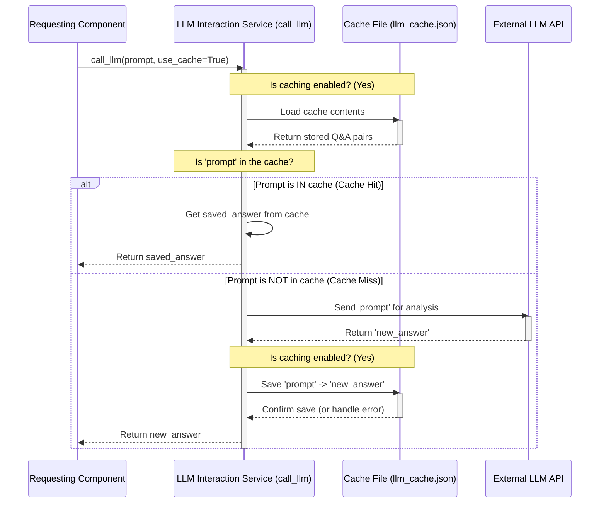

# Chapter 2: LLM Interaction Service


```markdown
# Chapter 2: LLM Interaction Service

In [Chapter 1: Configuration & Execution Entrypoint](01_configuration___execution_entrypoint_.md), we saw how our tutorial generator gets started and reads your instructions. We learned that it gathers all the settings into a shared space and then kicks off the main process.

But how does the generator actually *understand* the code and figure out how to explain it? It uses a powerful Artificial Intelligence called a Large Language Model (LLM) – think of it like a super-smart AI assistant that's really good at language and code. To talk to this AI assistant, our system needs a dedicated communication line. That's where the **LLM Interaction Service** comes in!

## What Problem Does This Solve?

Imagine you need expert advice on many different complex topics throughout a big project. You could hire one expert consultant. Now, instead of every single person in your project contacting the consultant directly (which would be chaotic!), you set up a central contact point – maybe a dedicated assistant or a specific phone number. This contact point handles scheduling calls, sending questions, receiving answers, and maybe even remembering past answers to avoid asking the same thing twice.

The LLM Interaction Service is like that central contact point for our AI consultant (the LLM).

*   **Simplifies Communication:** Other parts of our system don't need to know the complicated details of how to talk to the specific AI model (like API keys, server addresses, or specific data formats). They just send their question (a "prompt") to the service.
*   **Handles the Details:** The service takes the prompt, formats it correctly, sends it to the LLM using its API (Application Programming Interface - a way for programs to talk to each other), and gets the response back.
*   **Improves Efficiency (Caching):** What if we ask the AI the same question multiple times? It takes time and sometimes costs money to get a new answer. This service can remember (or "cache") previous questions and their answers. If the same question comes up again, the service just gives back the saved answer instantly!

## How Do Other Parts Use It?

Other components in our system, like the one that identifies the main ideas in the code ([Abstraction Identification](05_abstraction_identification_.md)) or the one that generates chapter text ([Chapter Content Generation](08_chapter_content_generation_.md)), need to ask the LLM questions.

They don't talk to the LLM directly. Instead, they use a simple function provided by this service, typically called something like `call_llm`.

Here's a simplified idea of how another part might use it:

```python
# Conceptual Example (Not actual code in main workflow like this)
from utils.call_llm import call_llm # Import the function

# Ask the LLM to explain a concept
question = "Explain the concept of 'variable' in Python in simple terms."

# Send the question to the LLM via the service
# The 'use_cache=True' part tells the service to try using a saved answer first
explanation = call_llm(question, use_cache=True)

# Now 'explanation' contains the LLM's answer
print(explanation)
```

This makes it very easy for any part of the PocketFlow system to leverage the power of the LLM without getting bogged down in technical communication details.

## Under the Hood: `utils/call_llm.py`

The main logic for this service lives in the `utils/call_llm.py` file. Let's peek inside to see how it works step-by-step when a component calls the `call_llm` function.

**1. Checking the Cache (Memory)**

First, if caching is enabled (which it usually is unless you used the `--no-cache` option we saw in Chapter 1), the service checks if it has seen this *exact same question* (prompt) before.

```python
# File: utils/call_llm.py (Simplified Snippet)
import json
import os

cache_file = "llm_cache.json" # Where saved answers are stored

def call_llm(prompt: str, use_cache: bool = True) -> str:
    cache = {}
    # Try to load previously saved answers if caching is on
    if use_cache and os.path.exists(cache_file):
        try:
            with open(cache_file, "r") as f:
                cache = json.load(f)
        except:
            # Handle cases where cache file might be corrupted
            pass

    # If the question is in our memory (cache), return the saved answer!
    if use_cache and prompt in cache:
        print("Cache hit!") # Let's imagine it prints this
        return cache[prompt] # Return the saved answer immediately
    # ... otherwise, we need to ask the LLM ...
```

Think of the `cache_file` like a notebook where the service writes down questions and answers. Before making an expensive call to the expert (LLM), it checks the notebook first.

**2. Calling the LLM (If Not Cached)**

If the question wasn't found in the cache, the service needs to actually talk to the LLM. It uses a library provided by the AI company (like Google's `genai` library for Gemini models) to send the prompt over the internet.

```python
# File: utils/call_llm.py (Simplified Snippet continued)
    # ... (cache check happened above) ...

    print("Cache miss. Calling LLM API...") # Let's imagine it prints this

    # --- This part actually talks to the AI ---
    # It uses configuration (like API keys) set up elsewhere
    # client = ... (setup code to connect to the AI service)
    # model = ... (specifies which AI model to use, e.g., 'gemini-2.5-pro')
    # response = client.models.generate_content(model=model, contents=[prompt])
    # response_text = response.text # Get the text answer from the AI
    # --- End AI communication ---

    # (Placeholder for actual API call)
    response_text = f"This is the AI's answer to: '{prompt[:30]}...'" # Simulate getting an answer

    # ... now we need to save this new answer ...
```

This is the core interaction – sending the request and receiving the response. The code handles authentication (proving we're allowed to use the AI) and uses the specific commands required by the LLM's API.

**3. Saving the Answer (Updating the Cache)**

Once the service gets a fresh answer from the LLM, and if caching is enabled, it saves this new question-answer pair to the cache file. This way, if the same question is asked again later, it can use the cached version.

```python
# File: utils/call_llm.py (Simplified Snippet continued)
    # ... (got response_text from LLM) ...

    # If caching is on, save the new answer to our notebook (cache file)
    if use_cache:
        cache[prompt] = response_text # Add the new Q&A pair
        try:
            # Write the updated notebook back to the file
            with open(cache_file, "w") as f:
                json.dump(cache, f)
        except Exception as e:
            # Handle potential errors when saving
            print(f"Warning: Failed to save cache: {e}")

    return response_text # Return the answer we got
```

This ensures the cache stays up-to-date with the latest answers obtained from the LLM.

**Visualizing the Flow**

Here’s a diagram showing the steps inside the `call_llm` function:



This diagram shows the two main paths: either the answer is found quickly in the cache, or the service has to go out to the LLM API and then save the result.

## Conclusion

The **LLM Interaction Service** is a crucial helper component within the PocketFlow system. It acts as the **central communicator** with the powerful Large Language Model. Its key responsibilities are:

1.  Providing a simple `call_llm` function for other parts of the system to use.
2.  Handling the technical details of communicating with the LLM's API.
3.  **Caching** results to speed up repeated requests and potentially save costs.

Think of it as the reliable translator and secretary for the brilliant AI consultant, ensuring smooth communication and efficient use of the expert's time.

Now that we know how the system gets its initial settings (Chapter 1) and how it talks to the AI (Chapter 2), how does it manage the overall process of generating a tutorial? What are the main steps involved, and in what order do they happen? That's the job of the [Workflow Orchestration](03_workflow_orchestration_.md), which we'll explore in the next chapter!

Let's move on to Chapter 3: [Workflow Orchestration](03_workflow_orchestration_.md)
```

---

Generated by [AI Codebase Knowledge Builder](https://github.com/The-Pocket/Tutorial-Codebase-Knowledge)