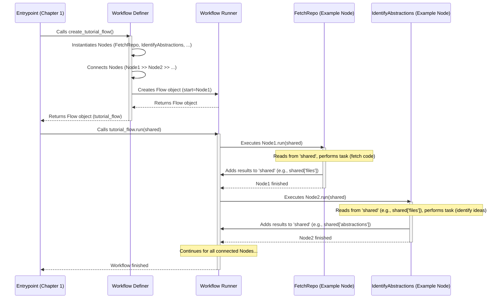

# Chapter 3: Workflow Orchestration

In [Chapter 1: Configuration & Execution Entrypoint](01_configuration___execution_entrypoint_.md), we saw how the application starts up and gathers all the settings you provide. In [Chapter 2: LLM Interaction Service](02_llm_interaction_service_.md), we learned how the application talks to the smart AI assistant (the LLM) to get help understanding code and generating text.

But generating a whole tutorial involves many steps! We need to:
1.  Get the code.
2.  Ask the AI to find the main ideas.
3.  Figure out how those ideas relate to each other.
4.  Decide the best order to explain them.
5.  Ask the AI to write the explanation for each idea (each chapter).
6.  Put everything together into the final tutorial files.

How does the application manage all these steps and make sure they happen in the correct order? That's the job of the **Workflow Orchestration**.

## What Problem Does This Solve?

Imagine you're baking a cake. You have a recipe that lists all the steps: mix the flour and sugar, add eggs, pour into a pan, bake, let cool, add frosting. You can't just do these steps in any random order! You need to follow the sequence precisely. Adding frosting before baking wouldn't work very well!

Similarly, our tutorial generator needs a "recipe" to follow. It needs a clear plan that defines:
*   **What are the steps?** (e.g., Fetch Code, Identify Concepts, Write Chapters)
*   **In what order should they happen?** (Fetch Code *before* Identifying Concepts)
*   **How does information pass from one step to the next?** (The code fetched in step 1 needs to be available for analysis in step 2)

The Workflow Orchestration component acts as the **master chef** or the **project manager**, ensuring each task (which we call a **Node**) is performed at the right time and that the results are passed along correctly.

## How it Works: The PocketFlow Library

To manage this sequence of steps, our project uses a helpful Python library called `PocketFlow`. Think of `PocketFlow` as a specialized toolkit for building and running step-by-step processes (workflows).

Here are the key ideas:

1.  **Workflow:** The entire sequence of steps needed to generate the tutorial. It's the complete recipe.
2.  **Node:** A single, specific task or step within the workflow. Each numbered item in our list above (Get code, Identify ideas, etc.) corresponds to a Node. Examples: `FetchRepo`, `IdentifyAbstractions`, `WriteChapters`.
3.  **Connecting Nodes:** PocketFlow allows us to easily define the order by "connecting" the nodes. We tell it: "Run Node A first, *then* run Node B using the result of Node A, *then* run Node C..."
4.  **Passing Data (`shared` dictionary):** Remember the `shared` dictionary from Chapter 1? PocketFlow uses this! Each Node can read information put there by previous Nodes (like the initial settings or the list of fetched files) and can add its own results to the `shared` dictionary for later Nodes to use.

## The Main Recipe: `flow.py`

The file `flow.py` contains the main "recipe" for generating the tutorial. It uses PocketFlow to define the sequence of Nodes.

Let's look at the core part of this file:

```python
# File: flow.py
from pocketflow import Flow
# Import all the step definitions (Nodes) from another file
from nodes import (
    FetchRepo,
    IdentifyAbstractions,
    AnalyzeRelationships,
    OrderChapters,
    WriteChapters,
    CombineTutorial
)

def create_tutorial_flow():
    """Creates and returns the codebase tutorial generation flow."""

    # Create an instance of each step (Node)
    fetch_repo = FetchRepo() # Task: Get the code
    identify_abstractions = IdentifyAbstractions(max_retries=5, wait=20) # Task: Find main ideas
    analyze_relationships = AnalyzeRelationships(max_retries=5, wait=20) # Task: How ideas connect
    order_chapters = OrderChapters(max_retries=5, wait=20) # Task: Decide chapter order
    write_chapters = WriteChapters(max_retries=5, wait=20) # Task: Write each chapter
    combine_tutorial = CombineTutorial() # Task: Assemble the final files

    # --- Define the sequence ---
    fetch_repo >> identify_abstractions
    identify_abstractions >> analyze_relationships
    analyze_relationships >> order_chapters
    order_chapters >> write_chapters
    write_chapters >> combine_tutorial
    # --- End sequence definition ---

    # Create the complete workflow, starting with 'fetch_repo'
    tutorial_flow = Flow(start=fetch_repo)

    return tutorial_flow # Return the workflow object
```

**Breaking it Down:**

1.  **Import Nodes:** It first imports all the different task definitions (like `FetchRepo`, `IdentifyAbstractions`) from the `nodes.py` file. We'll learn more about these specific Nodes in later chapters (like [Code Fetching](04_code_fetching_.md), [Abstraction Identification](05_abstraction_identification_.md)).
2.  **Create Node Instances:** It creates one instance (like a specific copy) of each Node task. Notice some Nodes have `max_retries=5, wait=20`. This tells PocketFlow that if a Node fails (maybe the AI gives a bad response), it should try again up to 5 times, waiting 20 seconds between tries. This makes our process more robust!
3.  **Define the Sequence (`>>`):** The magic happens with the `>>` operator. This symbol tells PocketFlow the order. `fetch_repo >> identify_abstractions` means: "Run `fetch_repo` first. When it's done, run `identify_abstractions`." The code chains all the steps together in the correct sequence.
4.  **Create the Flow:** Finally, `Flow(start=fetch_repo)` creates the complete workflow object, telling PocketFlow that the very first step is `fetch_repo`.
5.  **Return the Flow:** This `create_tutorial_flow()` function is called by `main.py` (from Chapter 1) to get the workflow object, which `main.py` then runs using `tutorial_flow.run(shared)`.

## Visualizing the Workflow

We can think of the workflow defined in `flow.py` like an assembly line:

```mermaid
graph LR
    A[Start] --> B(Fetch Code<br/>Node: FetchRepo);
    B --> C(Identify Ideas<br/>Node: IdentifyAbstractions);
    C --> D(Analyze Connections<br/>Node: AnalyzeRelationships);
    D --> E(Order Chapters<br/>Node: OrderChapters);
    E --> F(Write Chapters<br/>Node: WriteChapters);
    F --> G(Combine Tutorial<br/>Node: CombineTutorial);
    G --> H[End: Tutorial Files];

    style B fill:#f9f,stroke:#333,stroke-width:2px
    style C fill:#f9f,stroke:#333,stroke-width:2px
    style D fill:#f9f,stroke:#333,stroke-width:2px
    style E fill:#f9f,stroke:#333,stroke-width:2px
    style F fill:#f9f,stroke:#333,stroke-width:2px
    style G fill:#f9f,stroke:#333,stroke-width:2px
```



This diagram shows the exact sequence defined by the `>>` connections in `flow.py`. PocketFlow ensures each step runs only after the previous one finishes successfully.

Here's how the `main.py` script interacts with the workflow:



This shows `main.py` getting the defined workflow from `flow.py` and then telling the PocketFlow library to run it step-by-step, passing the `shared` dictionary along the way.

## Conclusion

The **Workflow Orchestration**, primarily defined in `flow.py` using the `PocketFlow` library, acts as the **master plan** or **recipe** for generating a tutorial. It solves the problem of managing a complex sequence of tasks by:

1.  Defining individual steps as **Nodes**.
2.  Specifying the exact **order** using connections (`>>`).
3.  Using the `PocketFlow` library to **execute** the steps in sequence.
4.  Facilitating **data sharing** between steps via the `shared` dictionary.

Think of it as the director coordinating all the different actors and scenes to produce the final movie (the tutorial).

Now that we understand the overall plan, let's dive into the very first step defined in our workflow: actually getting the code from GitHub or a local directory.

Let's move on to Chapter 4: [Code Fetching](04_code_fetching_.md)

---

Generated by [AI Codebase Knowledge Builder](https://github.com/The-Pocket/Tutorial-Codebase-Knowledge)