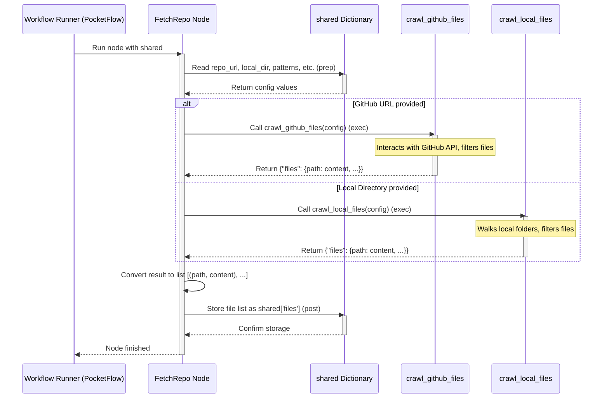

# Chapter 4: Code Fetching

In the previous chapter, [Workflow Orchestration](03_workflow_orchestration_.md), we saw how the tutorial generator follows a step-by-step plan, like a recipe, to create the final tutorial. The very first step in that recipe is getting the ingredients – the source code itself!

This chapter explains the **Code Fetching** process. Think of it like sending a helpful librarian to get specific books (code files) for you. You tell the librarian which library section to visit (Is the code on GitHub online, or in a folder on your computer?) and exactly which types of books to grab or ignore.

## What Problem Does This Solve?

Before our AI assistant ([LLM Interaction Service](02_llm_interaction_service_.md)) can understand a project and help write a tutorial about it, it needs to *see* the code! But where is this code?

*   Is it stored online in a public place like **GitHub**?
*   Is it in a **folder** right here on your computer?

Also, not all files in a project are equally important for understanding it. We might want to:

*   **Include** only certain types of files (e.g., only Python `.py` files).
*   **Exclude** specific files or folders (e.g., ignore test code, images, or temporary build files).
*   **Skip** really large files that might overwhelm the AI or aren't core source code.

The Code Fetching step handles all of this: finding the code source, retrieving the relevant files, and filtering them based on your instructions.

## The Librarian Analogy

Imagine you need research material. You send a librarian with a list:
1.  Go to the "Computer Science" section (like specifying a GitHub repo or local directory).
2.  Only get books with ".py" on the spine (like `--include "*.py"`).
3.  Ignore anything labelled "Tests" or "Images" (like `--exclude "*/test/*"` or `--exclude "*.jpg"`).
4.  Skip any book over 1000 pages (like `--max-file-size 1000000`).

The Code Fetching component is our librarian, carefully gathering exactly the code files we need for analysis.

## How it Works: The `FetchRepo` Node

Remember the workflow defined in `flow.py` (from [Workflow Orchestration](03_workflow_orchestration_.md))? The first node (step) in that flow is called `FetchRepo`. This node is our librarian.

**1. Checking the Order Slip (`prep` step):**

Before fetching anything, the `FetchRepo` node looks at the `shared` dictionary we learned about in [Chapter 1: Configuration & Execution Entrypoint](01_configuration___execution_entrypoint_.md). It checks the "order slip" – the instructions you provided via command-line arguments:

*   `shared['repo_url']`: Is there a GitHub URL specified (`--repo`)?
*   `shared['local_dir']`: Is there a local directory path specified (`--dir`)?
*   `shared['include_patterns']`: Are there specific file types to include (`--include`)?
*   `shared['exclude_patterns']`: Are there files/folders to ignore (`--exclude`)?
*   `shared['max_file_size']`: Is there a size limit for files (`--max-file-size`)?

```python
# File: nodes.py (Inside FetchRepo class - Simplified)

    def prep(self, shared):
        # Get instructions from the shared dictionary
        repo_url = shared.get("repo_url") # From --repo
        local_dir = shared.get("local_dir") # From --dir
        include_patterns = shared["include_patterns"] # From --include
        exclude_patterns = shared["exclude_patterns"] # From --exclude
        max_file_size = shared["max_file_size"] # From --max-file-size
        # ... other details like GitHub token ...

        # Prepare the exact details needed for fetching
        return {
            "repo_url": repo_url,
            "local_dir": local_dir,
            "include_patterns": include_patterns,
            "exclude_patterns": exclude_patterns,
            "max_file_size": max_file_size,
            # ...
        }
```

This `prep` step just gets all the necessary information ready.

**2. Visiting the Library Section (`exec` step):**

Now, the `FetchRepo` node decides where to go based on the instructions:

*   If `repo_url` exists, it knows the code is on GitHub. It calls a helper function `crawl_github_files`.
*   If `local_dir` exists, it knows the code is on the local computer. It calls a different helper function `crawl_local_files`.

```python
# File: nodes.py (Inside FetchRepo class - Simplified)

    def exec(self, prep_res): # 'prep_res' has the details from prep step
        if prep_res["repo_url"]:
            print(f"Crawling repository: {prep_res['repo_url']}...")
            # Go to the GitHub section
            result = crawl_github_files( # Call the GitHub helper
                repo_url=prep_res["repo_url"],
                # Pass along include/exclude patterns, size limit, etc.
                include_patterns=prep_res["include_patterns"],
                exclude_patterns=prep_res["exclude_patterns"],
                max_file_size=prep_res["max_file_size"],
                # ...
            )
        else:
            print(f"Crawling directory: {prep_res['local_dir']}...")
            # Go to the Local Disk section
            result = crawl_local_files( # Call the Local helper
                directory=prep_res["local_dir"],
                # Pass along include/exclude patterns, size limit, etc.
                include_patterns=prep_res["include_patterns"],
                exclude_patterns=prep_res["exclude_patterns"],
                max_file_size=prep_res["max_file_size"],
                # ...
            )
        # 'result' contains the fetched file paths and content
        files_list = list(result.get("files", {}).items())
        # ... error check ...
        print(f"Fetched {len(files_list)} files.")
        return files_list # Return the list of (path, content)
```

This `exec` step does the actual work of calling the correct helper function to retrieve the files.

**3. Storing the Results (`post` step):**

Finally, the `FetchRepo` node takes the list of files (each file represented as its path and its text content) returned by the helper function and stores it back into the `shared` dictionary under the key `'files'`.

```python
# File: nodes.py (Inside FetchRepo class - Simplified)

    def post(self, shared, prep_res, exec_res):
        # 'exec_res' is the files_list returned by the exec step
        shared["files"] = exec_res # Store the result in shared memory
```

Now, any later step in the workflow can access `shared['files']` to get the code content.

Here's a diagram showing the `FetchRepo` node's role:



## The Helper Librarians: `crawl_github_files` & `crawl_local_files`

The `FetchRepo` node delegates the actual fetching to two specialized helper functions found in the `utils/` directory:

*   **`utils/crawl_github_files.py`**: This function knows how to talk to the GitHub API (GitHub's way for programs to interact with it). It requests the list of files in the specified repository, checks filters and size limits, and downloads the content of the allowed files.
*   **`utils/crawl_local_files.py`**: This function walks through the folders and subfolders of the specified local directory on your computer. For each file it finds, it checks the include/exclude patterns (including `.gitignore` rules if present!) and the size limit, and reads the content of the allowed files.

You don't need to know the complex details of *how* these helpers work, just that they are the specialists called by `FetchRepo` to do the actual fetching and filtering from either GitHub or your local disk.

## The Result: A Bag of Books (Code Files)

After the `FetchRepo` node finishes, the `shared['files']` entry in our shared dictionary holds a list. Each item in the list represents one fetched code file and contains two pieces of information:

1.  The **path** to the file (e.g., `src/main_logic.py` or `components/button.js`).
2.  The actual text **content** of that file.

This list is the "bag of books" our librarian has collected, ready for the next step in our tutorial generation process.

## Conclusion

The **Code Fetching** step, orchestrated by the `FetchRepo` node, is the crucial first stage in our workflow. It acts like a librarian, responsible for:

1.  Reading your instructions (GitHub URL or local path, filters, size limits) from the `shared` dictionary.
2.  Calling the appropriate helper function (`crawl_github_files` or `crawl_local_files`) to retrieve the code.
3.  Applying include/exclude patterns and size limits to get only the relevant files.
4.  Storing the fetched file paths and their content into `shared['files']` for later use.

Now that our librarian has successfully gathered the necessary source code, what's next? We need to understand what the main ideas or concepts *are* within that code. That's the job of the next step in our workflow!

Let's move on to Chapter 5: [Abstraction Identification](05_abstraction_identification_.md)

---

Generated by [AI Codebase Knowledge Builder](https://github.com/The-Pocket/Tutorial-Codebase-Knowledge)