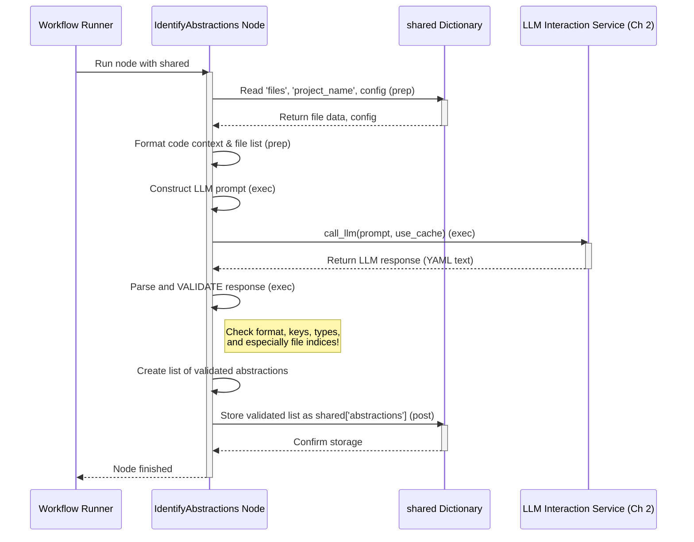

# Chapter 5: Abstraction Identification


```markdown
# Chapter 5: Abstraction Identification

In [Chapter 4: Code Fetching](04_code_fetching_.md), we learned how our trusty librarian gathered all the necessary code files (the "books") from either GitHub or your local computer. We now have the raw material – the source code!

But just having a pile of code files isn't enough to understand a project. Imagine being handed a stack of detailed construction blueprints for a huge skyscraper. It's overwhelming! How do you quickly grasp the main structure? You'd want someone to point out the key parts: "Here's the foundation, this section is the main lobby, these are the residential floors, and that's the rooftop area."

This chapter explains how our tutorial generator acts like an **architect**, studying the blueprints (the code) to identify these main sections or concepts, which we call **abstractions**.

## What Problem Does This Solve?

A typical software project has many files and thousands of lines of code. Trying to understand it by reading everything from start to finish is inefficient and confusing for a newcomer. We need a high-level map first.

*   **How do we find the "big picture" ideas?** What are the 5-10 core components or concepts someone *must* understand to get started?
*   **How do we get simple explanations?** Once we identify these concepts, how can we describe them in a way that's easy for beginners?
*   **Which files relate to which concept?** If someone wants to dive deeper into a specific concept, where should they look in the code?

The **Abstraction Identification** step solves this by using our AI assistant, the [LLM Interaction Service](02_llm_interaction_service_.md), to analyze the code and extract these essential abstractions.

## The Architect Analogy

Think of this step like hiring a skilled architect (the LLM). We give the architect the complete set of blueprints (the fetched code files from `shared['files']`). We then ask the architect:

"Please study these blueprints and tell me the 5 to 10 most important functional areas of this building. For each area, give me:
1.  A simple, descriptive **name** (like "Foundation" or "Living Area").
2.  A brief, beginner-friendly **description** explaining its purpose, maybe using an analogy (like "The foundation supports the entire structure, like the roots of a tree").
3.  A list of the specific blueprint **pages** (file indices) relevant to that area."

This step takes the raw code and transforms it into a structured list of key concepts, making the project much easier to approach.

## How it Works: The `IdentifyAbstractions` Node

Following our recipe from [Chapter 3: Workflow Orchestration](03_workflow_orchestration_.md), the step immediately after `FetchRepo` (Code Fetching) is the `IdentifyAbstractions` node. This node manages the process of asking the LLM to identify the core concepts.

Here's how it works, broken down into the standard PocketFlow node steps (`prep`, `exec`, `post`):

**1. Preparing the Blueprints (`prep` step):**

Before talking to the architect (LLM), this node needs to organize the information. It gets the list of fetched files (`shared['files']`) from the shared dictionary. It also gets other settings like the project name, the desired language for the output, whether to use the cache ([LLM Interaction Service](02_llm_interaction_service_.md)), and the maximum number of abstractions requested (`shared['max_abstraction_num']`).

It then formats the content of all fetched files, along with their index numbers and paths, into a single block of text (the `context`). This is like neatly laying out all the blueprints for the architect.

```python
# File: nodes.py (Inside IdentifyAbstractions class - Simplified prep)

    def prep(self, shared):
        files_data = shared["files"] # Get [(path, content), ...] from Chapter 4
        project_name = shared["project_name"]
        language = shared.get("language", "english")
        use_cache = shared.get("use_cache", True)
        max_abstraction_num = shared.get("max_abstraction_num", 10)

        # Helper function formats all file content into one big string
        context, file_info = create_llm_context(files_data)
        # Create a simple list like "0 # path/to/file1.py\n1 # path/to/file2.js"
        file_listing_for_prompt = "\n".join(
            [f"- {idx} # {path}" for idx, path in file_info]
        )

        # Return all needed info for the next step
        return (
            context, # The combined code content
            file_listing_for_prompt, # The numbered list of files
            len(files_data), # How many files total (for validation later)
            project_name,
            language,
            use_cache,
            max_abstraction_num,
        )
```

**2. Asking the Architect (`exec` step):**

This is where the magic happens. The `exec` step takes the prepared context and instructions and crafts a detailed **prompt** (a question or command) for the [LLM Interaction Service](02_llm_interaction_service_.md).

The prompt essentially says:
*"Analyze the following code (`context`) for the project `{project_name}`. Here is a list of all the files (`file_listing_for_prompt`). Identify the {max_abstraction_num} most important concepts (abstractions). For each, give me a `name`, a beginner-friendly `description` with an analogy (in {language}!), and the `file_indices` (like `0 # path/file.py`) relevant to it. Format your answer as a YAML list."*

```python
# File: nodes.py (Inside IdentifyAbstractions class - Simplified exec)

    def exec(self, prep_res):
        # Unpack the results from the prep step
        (context, file_listing, file_count, project_name,
         language, use_cache, max_abstraction_num) = prep_res

        print(f"Identifying abstractions using LLM...")

        # --- Construct the detailed prompt for the LLM ---
        prompt = f"""
For the project `{project_name}`:

Codebase Context:
{context}

Identify the top 5-{max_abstraction_num} core abstractions...
For each abstraction, provide:
1. `name` (in {language})
2. `description` (in {language}, with analogy, ~100 words)
3. `file_indices` (using format `idx # path/comment`)

List of file indices and paths:
{file_listing}

Format the output as a YAML list:
```yaml
- name: |
    Example Name (in {language})
  description: |
    Example description and analogy (in {language}).
  file_indices:
    - 0 # path/to/file1.py
    - 3 # path/to/related.py
# ... more abstractions ...
```"""
        # --- Call the LLM Service ---
        # This sends the prompt and gets the AI's response
        response = call_llm(prompt, use_cache=use_cache)

        # --- Validation ---
        # (Code here parses the LLM's YAML response)
        # (It checks if the format is correct: list of dicts)
        # (It checks for required keys: name, description, file_indices)
        # (It validates 'name' and 'description' are strings)
        # (It validates 'file_indices' is a list)
        # (MOST IMPORTANT: It validates each file index is a valid number
        #  within the range 0 to file_count-1, extracting just the number)
        validated_abstractions = parse_and_validate_llm_response(response, file_count)
        # validated_abstractions is like:
        # [ {'name': '...', 'description': '...', 'files': [0, 3]}, ... ]

        print(f"Identified {len(validated_abstractions)} abstractions.")
        return validated_abstractions
```

Crucially, after getting the response from the LLM, this step **validates** it carefully. It checks if the response is in the correct format and if the file indices provided by the LLM actually correspond to real files fetched earlier. This ensures we don't proceed with bad data. Only the valid, cleaned-up list of abstractions is returned.

**3. Storing the Findings (`post` step):**

Finally, the `post` step takes the validated list of abstractions (each being a dictionary with `name`, `description`, and a list of integer `files` indices) and stores it back into the central `shared` dictionary under the key `'abstractions'`.

```python
# File: nodes.py (Inside IdentifyAbstractions class - Simplified post)

    def post(self, shared, prep_res, exec_res):
        # exec_res is the validated_abstractions list from the exec step
        shared["abstractions"] = exec_res # Store the results
```

Now, the `shared['abstractions']` dictionary holds the high-level map of the codebase, ready for the next steps in the workflow.

## Visualizing the Process

Here’s a sequence diagram showing how the `IdentifyAbstractions` node works:



This shows the node getting data from `shared`, preparing it, asking the LLM via the service, validating the answer, and storing the final result back in `shared`.

## Conclusion

The **Abstraction Identification** step, performed by the `IdentifyAbstractions` node, acts as the project's **architect**. It bridges the gap between raw code and high-level understanding. Its key contributions are:

1.  Taking the fetched code files (`shared['files']`).
2.  Using the [LLM Interaction Service](02_llm_interaction_service_.md) to analyze the code.
3.  Asking the LLM to identify the core concepts (**abstractions**).
4.  Requesting a `name`, beginner-friendly `description` (with analogy), and relevant `file_indices` for each abstraction.
5.  **Validating** the LLM's response carefully.
6.  Storing the validated list of abstractions in `shared['abstractions']`.

This gives us a crucial, high-level map of the codebase. We now know the main "rooms" or "sections" of our project building. But how do these rooms connect? How does someone get from the lobby to the residential floors?

The next step is to figure out the relationships *between* these abstractions.

Let's move on to Chapter 6: [Relationship Analysis](06_relationship_analysis_.md)
```

---

Generated by [AI Codebase Knowledge Builder](https://github.com/The-Pocket/Tutorial-Codebase-Knowledge)