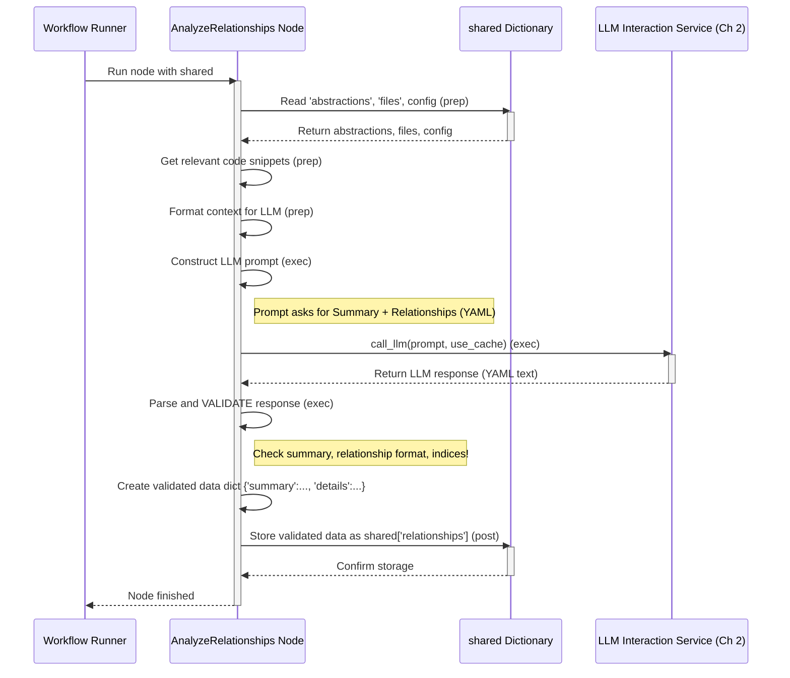

# Chapter 6: Relationship Analysis


```markdown
# Chapter 6: Relationship Analysis

In [Chapter 5: Abstraction Identification](05_abstraction_identification_.md), we saw how our system acted like an architect, studying the code blueprints to identify the main "rooms" or concepts (abstractions) of the project. We now have a list of these key areas, each with a name and description.

But knowing the rooms in a building isn't quite enough. How do they connect? Is there a hallway between the kitchen and the dining room? Does the elevator go to the rooftop deck? To truly understand the building (or the software project), we need to understand how these different parts interact.

This chapter explains the **Relationship Analysis** step. Think of this like taking that list of rooms (abstractions) and drawing arrows on a whiteboard between them to show which room connects to which, and why (e.g., "Kitchen *provides food to* Dining Room"). This step also creates a general summary of the entire project.

## What Problem Does This Solve?

We have the individual puzzle pieces (the abstractions), but how do they fit together to form the complete picture?

*   **How do abstractions interact?** Does `Component A` use `Component B`? Does `Module X` send data to `Module Y`? Understanding these connections is key to understanding the project's flow and structure.
*   **What's the overall project about?** Before diving into individual chapters, it's helpful to have a short, high-level summary of what the project does.
*   **How can we visualize the structure?** Seeing the connections visually (like our whiteboard diagram) can make the project structure much clearer.

The Relationship Analysis step uses the AI ([LLM Interaction Service](02_llm_interaction_service_.md)) again, but this time it asks the AI to look *specifically* at how the identified abstractions relate to each other and to summarize the project's purpose.

## The Whiteboard Analogy

Imagine you listed all the teams in your company on a whiteboard: Sales, Marketing, Engineering, Support. Just listing them doesn't tell you how they work together.

Now, you start drawing arrows:
*   Marketing -> Sales ("Generates leads for")
*   Engineering -> Support ("Provides technical details for")
*   Sales -> Engineering ("Gives customer feedback to")

You also write a brief summary at the top: "Our company builds and sells software to help people manage tasks."

This step does exactly that for our codebase abstractions. It asks the AI to:
1.  Write a short **project summary**.
2.  Draw the **arrows** (define relationships) between the abstractions, giving each arrow a label explaining the connection.

## How it Works: The `AnalyzeRelationships` Node

Following our workflow recipe from [Chapter 3: Workflow Orchestration](03_workflow_orchestration_.md), the step after `IdentifyAbstractions` is the `AnalyzeRelationships` node. This node manages the process of asking the LLM to analyze the connections.

Let's look at its steps (`prep`, `exec`, `post`):

**1. Preparing the Context (`prep` step):**

Before asking the LLM about relationships, we need to give it the right information. This node gets the list of abstractions (`shared['abstractions']`) identified in the previous step. For each abstraction, it knows its name, description, and the relevant file indices.

It also needs the actual code content, but only for the files that are relevant to these abstractions. It uses a helper function (`get_content_for_indices`) to fetch the code snippets for just those important files from `shared['files']`.

Finally, it combines all this information into a structured text block (`context`) for the LLM:
*   A list of the abstraction indices and their names.
*   The description of each abstraction.
*   The relevant code snippets, labelled with their original file path and index.
*   It also retrieves the project name, desired language, and cache settings from the `shared` dictionary.

```python
# File: nodes.py (Inside AnalyzeRelationships class - Simplified prep)

    def prep(self, shared):
        abstractions = shared["abstractions"] # List of {'name': ..., 'description': ..., 'files': [indices]}
        files_data = shared["files"]         # List of (path, content)
        project_name = shared["project_name"]
        language = shared.get("language", "english")
        use_cache = shared.get("use_cache", True)

        num_abstractions = len(abstractions)
        context = "Identified Abstractions:\n"
        all_relevant_indices = set()
        abstraction_info_for_prompt = [] # For the simple index/name list

        # Build context with details for each abstraction
        for i, abstr in enumerate(abstractions):
            file_indices_str = ", ".join(map(str, abstr["files"]))
            # Use potentially translated name/description from previous step
            info_line = f"- Index {i}: {abstr['name']} (Files: [{file_indices_str}])\n  Desc: {abstr['description']}"
            context += info_line + "\n"
            abstraction_info_for_prompt.append(f"{i} # {abstr['name']}") # Simple list for prompt
            all_relevant_indices.update(abstr["files"]) # Collect all relevant file indices

        context += "\nRelevant File Snippets:\n"
        # Get code content ONLY for relevant files
        relevant_files_content_map = get_content_for_indices(
            files_data, sorted(list(all_relevant_indices))
        )
        # Add code snippets to the context
        file_context_str = "\n\n".join(
            f"--- File: {idx_path} ---\n{content}"
            for idx_path, content in relevant_files_content_map.items()
        )
        context += file_context_str

        # Return everything needed for the LLM call
        return (
            context, # Abstraction details + relevant code
            "\n".join(abstraction_info_for_prompt), # Simple index # name list
            num_abstractions,
            project_name,
            language,
            use_cache,
        )
```

**2. Asking the LLM (`exec` step):**

Now, the node constructs a prompt for the [LLM Interaction Service](02_llm_interaction_service_.md). This prompt asks the LLM to perform two main tasks based on the provided context:

1.  **Write a project `summary`:** A short, beginner-friendly overview of the project's purpose, written in the requested `language` and using Markdown for emphasis (like **bold** or *italics*).
2.  **Identify `relationships`:** Determine how the abstractions interact. For each significant interaction, provide:
    *   `from_abstraction`: The index and name of the source abstraction.
    *   `to_abstraction`: The index and name of the target abstraction.
    *   `label`: A very short description of the relationship (e.g., "Uses data from", "Sends commands to", "Is part of"), also in the requested `language`.
    *   The prompt specifically asks the LLM to ensure *every* abstraction is included in at least one relationship.

The prompt requests the output in a specific YAML format.

```python
# File: nodes.py (Inside AnalyzeRelationships class - Simplified exec)

    def exec(self, prep_res):
        (context, abstraction_listing, num_abstractions,
         project_name, language, use_cache) = prep_res

        print(f"Analyzing relationships using LLM...")
        # Construct the prompt (Simplified version)
        language_instruction = f"Generate the `summary` and relationship `label` fields in **{language.capitalize()}**." # (If not English)
        lang_hint = f" (in {language.capitalize()})" # (If not English)

        prompt = f"""
Based on these abstractions and code for project '{project_name}':

Abstraction List:
{abstraction_listing}

Context (Abstractions, Descriptions, Code):
{context}

{language_instruction}
Please provide:
1. A project `summary` (beginner-friendly){lang_hint}.
2. A list of `relationships` between abstractions:
   - `from_abstraction`: index # Name
   - `to_abstraction`: index # Name
   - `label`: Short description of interaction{lang_hint}.
   Make sure every abstraction index (0 to {num_abstractions-1}) appears.

Format as YAML:
```yaml
summary: |
  Project overview here{lang_hint}.
relationships:
  - from_abstraction: 0 # NameA
    to_abstraction: 1 # NameB
    label: "Does something to"{lang_hint}
  # ... more relationships ...
```"""

        # Call the LLM Service
        response = call_llm(prompt, use_cache=use_cache)

        # --- Validation ---
        # (Code here parses the YAML response)
        # (Checks for 'summary' string and 'relationships' list)
        # (For each relationship, checks for keys 'from_abstraction', 'to_abstraction', 'label')
        # (Validates 'label' is a string)
        # (Parses indices from 'from_abstraction', 'to_abstraction')
        # (VALIDATES indices are within the range 0 to num_abstractions-1)
        validated_data = parse_and_validate_relationships(response, num_abstractions)
        # validated_data format: {'summary': str, 'details': [{'from': int, 'to': int, 'label': str}]}

        print("Generated project summary and relationship details.")
        return validated_data
```

Just like in the previous step, this node carefully **validates** the LLM's response. It checks if the structure is correct (YAML with `summary` and `relationships`) and if the relationship details make sense (valid indices, required labels). This ensures we only proceed with good, structured data.

**3. Storing the Results (`post` step):**

The node takes the validated dictionary containing the project summary and the list of relationship details and stores it in the `shared` dictionary under the key `'relationships'`.

```python
# File: nodes.py (Inside AnalyzeRelationships class - Simplified post)

    def post(self, shared, prep_res, exec_res):
        # exec_res is the validated dictionary {'summary': ..., 'details': ...}
        shared["relationships"] = exec_res # Store the results
```

Now `shared['relationships']` holds the project overview and the map of connections between the core concepts.

## Visualizing the Process

Here's a diagram showing how the `AnalyzeRelationships` node operates:



This flow shows the node gathering necessary context, asking the LLM to analyze relationships and summarize, validating the response, and storing the structured results.

## Conclusion

The **Relationship Analysis** step, carried out by the `AnalyzeRelationships` node, acts like the person drawing the connections on our whiteboard. It takes the identified abstractions and figures out how they fit together. Its key contributions are:

1.  Preparing a context with abstraction details and relevant code snippets.
2.  Asking the [LLM Interaction Service](02_llm_interaction_service_.md) to:
    *   Generate a high-level **project summary**.
    *   Identify key **relationships** between abstractions (which abstraction interacts with which, and how).
3.  Requesting the results (summary and relationship labels) in the specified **language**.
4.  **Validating** the LLM's output carefully.
5.  Storing the structured results (summary and relationship details) in `shared['relationships']`.

We now have not only the main concepts but also a summary of the whole project and an understanding of how the concepts interact. This is crucial information! Knowing the relationships helps us figure out the best order to explain these concepts in the final tutorial.

What *is* the best order? That's exactly what the next step in our workflow tackles!

Let's move on to Chapter 7: [Chapter Ordering Logic](07_chapter_ordering_logic_.md)
```

---

Generated by [AI Codebase Knowledge Builder](https://github.com/The-Pocket/Tutorial-Codebase-Knowledge)