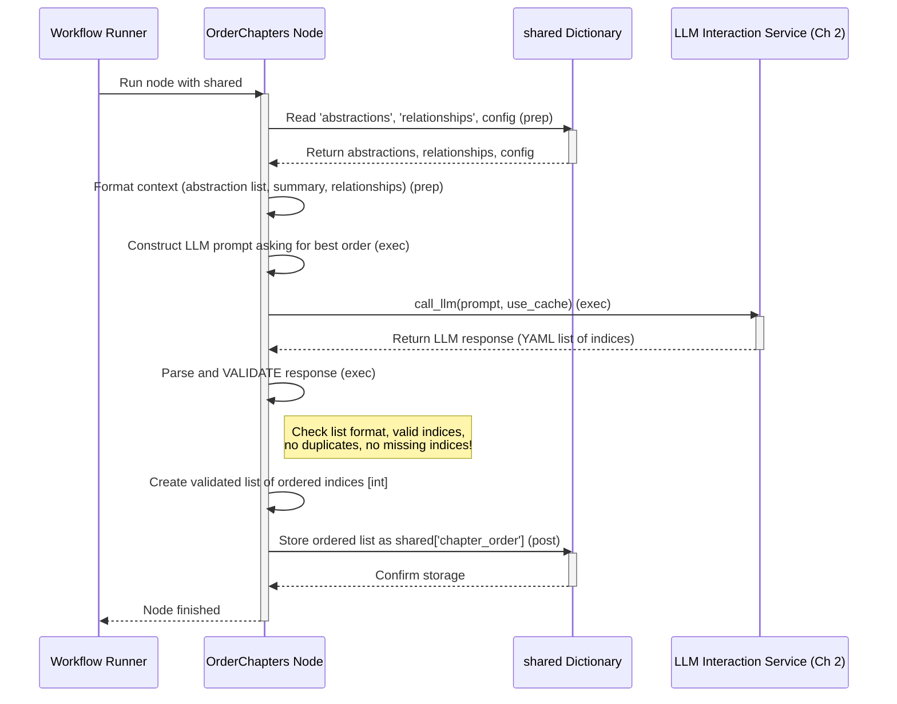

# Chapter 7: Chapter Ordering Logic


```markdown
# Chapter 7: Chapter Ordering Logic

In the previous chapter, [Relationship Analysis](06_relationship_analysis_.md), we used our AI assistant to understand how the main concepts (abstractions) of the project connect, like drawing arrows on a whiteboard showing how different teams in a company work together. We also got a nice project summary.

So now we have:
1.  A list of the key abstractions (the "rooms" in our building).
2.  An understanding of how they relate to each other (the "hallways" and "connections").

But if you were giving someone a tour of the building, where would you start? The lobby? The foundation? The coolest feature? Just knowing the rooms and connections isn't enough; you need a *plan* for the tour to make sense. This chapter explains how our system figures out the best **order** to present the abstractions in the final tutorial.

## What Problem Does This Solve?

Imagine learning a new skill, like cooking. A good cookbook doesn't just throw recipes at you randomly. It usually starts with basic techniques (like chopping vegetables or boiling water) before moving on to simple dishes, and only then tackling complex meals. This structured order makes learning easier.

Similarly, when generating a tutorial for a codebase:

*   **How do we ensure a smooth learning curve?** We want beginners to grasp foundational ideas before diving into complicated specifics.
*   **What's the most logical sequence?** Should we explain the user interface first, or the database connection? Should we cover the main entry point before helper functions?

The **Chapter Ordering Logic** step tackles this by deciding the most effective sequence to present the identified abstractions, aiming for a tutorial that flows logically from start to finish. Think of it like planning a course curriculum or arranging the steps in a recipe.

## The Curriculum Planner Analogy

Think of this step as a **curriculum planner**. We give the planner:
1.  The list of **topics** (our abstractions with their names).
2.  Information on how the topics **relate** (the relationships identified earlier).
3.  The overall **subject summary** (the project summary).

The planner's job is to arrange these topics into a sequence (Chapter 1, Chapter 2, Chapter 3...) that makes the most sense for learning. They might decide to put fundamental topics first, followed by topics that build upon them, similar to teaching addition before multiplication.

## How it Works: The `OrderChapters` Node

In our [Workflow Orchestration](03_workflow_orchestration_.md), the step following `AnalyzeRelationships` is the `OrderChapters` node. This node acts as our curriculum planner, using the AI assistant one more time to determine the chapter sequence.

Here’s the breakdown:

**1. Gathering the Course Materials (`prep` step):**

First, the `OrderChapters` node gathers all the necessary information from the `shared` dictionary:

*   `shared['abstractions']`: The list of identified abstractions (e.g., `[{'name': 'Data Input', 'description': '...', 'files': [0, 2]}, ...]`). Note that names/descriptions might be in the target language already.
*   `shared['relationships']`: The project summary and the list of connections between abstractions (e.g., `{'summary': '...', 'details': [{'from': 0, 'to': 1, 'label': 'Sends data to'}, ...]}`). Summary/labels might also be translated.
*   `shared['project_name']`, `shared['language']`, `shared['use_cache']`.

It then prepares this information in a structured way for the AI:

*   A simple numbered list of abstraction indices and their names (e.g., `0 # Data Input`).
*   The project summary generated in the previous step.
*   A clear description of the relationships found (e.g., "From 0 (Data Input) to 1 (Processing): Sends data to").

```python
# File: nodes.py (Inside OrderChapters class - Simplified prep)

    def prep(self, shared):
        abstractions = shared["abstractions"] # Names might be translated
        relationships = shared["relationships"] # Summary/labels might be translated
        project_name = shared["project_name"]
        language = shared.get("language", "english")
        use_cache = shared.get("use_cache", True)

        # Create a numbered list of abstractions for the prompt
        abstraction_info_for_prompt = []
        for i, a in enumerate(abstractions):
            abstraction_info_for_prompt.append(
                f"- {i} # {a['name']}" # Use potentially translated name
            )
        abstraction_listing = "\n".join(abstraction_info_for_prompt)

        # Format context using potentially translated summary/labels
        summary_note = ""
        if language.lower() != "english":
             summary_note = f" (Note: Summary might be in {language.capitalize()})"

        context = f"Project Summary{summary_note}:\n{relationships['summary']}\n\n"
        context += "Relationships (Indices refer to abstractions above):\n"
        for rel in relationships["details"]:
            from_name = abstractions[rel["from"]]["name"] # Might be translated
            to_name = abstractions[rel["to"]]["name"] # Might be translated
            context += f"- From {rel['from']} ({from_name}) to {rel['to']} ({to_name}): {rel['label']}\n" # Label might be translated

        list_lang_note = ""
        if language.lower() != "english":
             list_lang_note = f" (Note: Names might be in {language.capitalize()})"


        return (
            abstraction_listing, # "0 # NameA \n 1 # NameB ..."
            context, # Summary + Relationship descriptions
            len(abstractions), # Total number of abstractions
            project_name,
            list_lang_note, # Hint about potential name translation
            use_cache,
        )
```

**2. Asking the Planner (`exec` step):**

This is where the node asks the AI ([LLM Interaction Service](02_llm_interaction_service_.md)) to act as the curriculum planner. It constructs a prompt that includes:

*   The list of abstractions (index and name).
*   The context about the project summary and relationships.
*   The core question: *"What is the best order to explain these abstractions in a tutorial for beginners? Start with foundational or entry-point concepts, then move to details. Output *only* the ordered list of abstraction indices in YAML format."*

```python
# File: nodes.py (Inside OrderChapters class - Simplified exec)

    def exec(self, prep_res):
        (abstraction_listing, context, num_abstractions,
         project_name, list_lang_note, use_cache) = prep_res

        print("Determining chapter order using LLM...")

        # Construct the prompt for the LLM
        prompt = f"""
Given the following project abstractions and their relationships for `{project_name}`:

Abstractions (Index # Name){list_lang_note}:
{abstraction_listing}

Context about relationships and project summary:
{context}

What is the best order to explain these abstractions in a tutorial for beginners?
Start with foundational/entry-point concepts (like user interfaces or core data structures).
Then move to concepts that depend on the earlier ones or provide more detail.
Aim for a logical flow that minimizes confusion.

Output ONLY the ordered list of abstraction indices (integers). Use the format `idx # AbstractionName` for clarity, but the primary output is the order of indices.

Format as a YAML list:
```yaml
- 2 # FoundationalConcept (Example)
- 0 # CoreClassA (Example)
- 1 # CoreClassB (Example, uses CoreClassA)
# ... continue for all abstraction indices ...
```

Now, provide the YAML output:
"""
        # Call the LLM Service
        response = call_llm(prompt, use_cache=use_cache)

        # --- Validation ---
        # (Code here parses the YAML response)
        # (Checks if it's a list)
        validated_indices = parse_and_validate_order(response, num_abstractions)
        # Validation ensures:
        # - It's a list of integers.
        # - All indices are valid (within 0 to num_abstractions-1).
        # - Each index appears exactly once (no duplicates, no missing indices).

        print(f"Determined chapter order (indices): {validated_indices}")
        return validated_indices # Return the list of integers [2, 0, 1, ...]
```

**Crucial Validation:** After getting the suggested order from the LLM, the node performs strict validation. It checks:
*   Is the output a list?
*   Does it contain only numbers (indices)?
*   Are all indices valid numbers corresponding to the abstractions we have?
*   Does the list include *every* abstraction index exactly once?

This ensures the LLM didn't hallucinate, forget an abstraction, or suggest an invalid order. Only a valid, complete order is accepted.

**3. Storing the Final Plan (`post` step):**

The validated list of ordered abstraction indices (e.g., `[2, 0, 1, 3, 4]`) is stored back into the `shared` dictionary under the key `'chapter_order'`.

```python
# File: nodes.py (Inside OrderChapters class - Simplified post)

    def post(self, shared, prep_res, exec_res):
        # exec_res is the validated list of ordered indices, e.g., [2, 0, 1, 3, 4]
        shared["chapter_order"] = exec_res # Store the final plan
```

This `shared['chapter_order']` list now represents the definitive sequence for the tutorial chapters.

## Visualizing the Process

Here's a sequence diagram illustrating the `OrderChapters` node's job:



The diagram shows the node gathering information, asking the LLM for the optimal order based on that information, rigorously validating the suggestion, and storing the final, approved order.

## Conclusion

The **Chapter Ordering Logic**, implemented by the `OrderChapters` node, acts as the tutorial's **curriculum planner**. It leverages the insights gained from previous steps (identified abstractions and their relationships) to determine the most effective learning path. Its key functions are:

1.  Preparing context including abstractions and their relationships for the AI.
2.  Asking the [LLM Interaction Service](02_llm_interaction_service_.md) to propose the best sequence for explaining these abstractions.
3.  Emphasizing a logical flow from foundational concepts to specifics.
4.  Performing strict **validation** to ensure the proposed order is complete and correct.
5.  Storing the final, validated sequence of abstraction indices in `shared['chapter_order']`.

We now have the blueprint for our tutorial! We know *what* topics (abstractions) to cover and in *what order*. The next logical step is to actually write the content for each of these chapters, following the plan we just created.

Let's move on to Chapter 8: [Chapter Content Generation](08_chapter_content_generation_.md)
```

---

Generated by [AI Codebase Knowledge Builder](https://github.com/The-Pocket/Tutorial-Codebase-Knowledge)