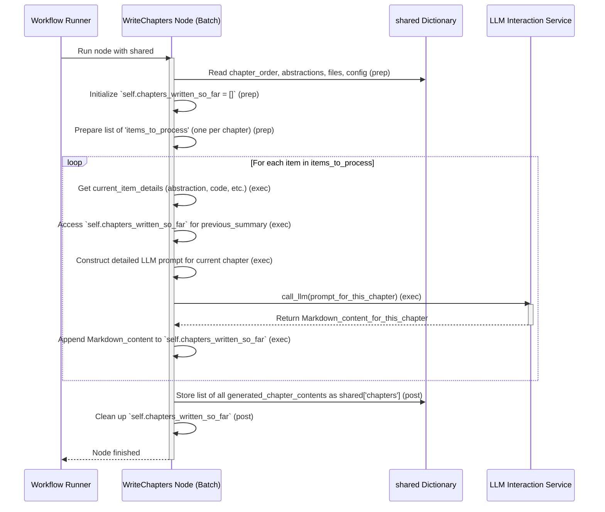

# Chapter 8: Chapter Content Generation

Welcome back! In [Chapter 7: Chapter Ordering Logic](07_chapter_ordering_logic_.md), we successfully planned our tutorial's "curriculum." We now have a specific sequence in which to present the core concepts (abstractions) of the project, ensuring a logical flow for learners.

But a plan isn't a tutorial! We have the chapter titles and the order, but we don't have the actual *content* for each chapter. How do we get from an ordered list of topics to fully written explanations, complete with code examples, analogies, and helpful diagrams? That's precisely what **Chapter Content Generation** handles.

## What Problem Does This Solve?

Imagine you're a technical writer tasked with creating a user manual. You've received an outline (our ordered list of abstractions) from the project manager. Now, your job is to sit down and write each section, explaining every feature step-by-step, providing examples, and making sure it all makes sense to a new user.

This "Chapter Content Generation" step is our automated technical writer. For each abstraction in our decided order, it needs to:

1.  **Gather all relevant information:** What is this abstraction about? What code files relate to it? What are the names and planned filenames of other chapters for linking? What was discussed in the *previous* chapter to ensure a smooth transition?
2.  **Craft a detailed request to the AI:** Ask the AI ([LLM Interaction Service](02_llm_interaction_service_.md)) to write a comprehensive, beginner-friendly chapter in Markdown format.
3.  **Instruct the AI on quality:** The request isn't just "write about X." It includes specific guidelines on tone, structure, use of analogies, code example formatting, including Mermaid diagrams, and how to link to other chapters.
4.  **Handle multiple languages:** If a different language was requested (like Spanish in [Chapter 1](01_configuration___execution_entrypoint_.md)), the AI is instructed to write the chapter content in that language.

This step transforms our structural plan into rich, readable tutorial content.

## The Technical Writer Analogy

Think of this stage like a team of technical writers working on a manual, one writer per chapter.
1.  Each writer receives a **briefing packet** for their assigned chapter:
    *   The chapter's main topic (the abstraction's name and description).
    *   Relevant code snippets.
    *   A style guide (how to write, formatting, linking rules).
    *   The overall table of contents (to know about other chapters).
    *   A copy of the *previous chapter* (to write a good introduction).
2.  The writer then drafts their chapter based on this packet.
3.  The finished draft is submitted.

Our `WriteChapters` node (which we'll see below) manages this process for each "chapter" (abstraction) in our tutorial.

## How it Works: The `WriteChapters` Node

In our [Workflow Orchestration](03_workflow_orchestration_.md), the `WriteChapters` node follows the `OrderChapters` node. This node is special because it's a `BatchNode`. This means it processes a list of items (our abstractions, in their decided order) one by one. This is crucial because to write Chapter 3 well, we need to know what was in Chapter 2.

Here's a breakdown of its `prep`, `exec` (per item), and `post` steps:

**1. Preparing All Briefing Packets (`prep` step):**

Before any writing begins, the `prep` step in `WriteChapters` gets all necessary information from the `shared` dictionary:
*   `shared['chapter_order']`: The list of abstraction indices in the desired tutorial order.
*   `shared['abstractions']`: The full details for each abstraction (name, description, related file indices). Note that names and descriptions might already be in the target language from earlier steps.
*   `shared['files_data']`: The actual content of all fetched code files.
*   `shared['project_name']`, `shared['language']`, `shared['use_cache']`.

It then creates a "briefing packet" (an item) for each chapter to be written. This involves:
*   Determining the chapter number, name, and filename (e.g., `01_configuration.md`).
*   Gathering the specific abstraction's details (name, description, and relevant code snippets using `get_content_for_indices`).
*   Creating a `full_chapter_listing` (a formatted list of all chapter numbers, titles, and filenames, like a table of contents – this is used in the prompt so the AI knows how to link between chapters).
*   Storing information about the `prev_chapter` and `next_chapter` (if they exist) to help the AI write smooth transitions.
*   Initializing an internal list `self.chapters_written_so_far` which will store the *actual Markdown content* of chapters as they are generated. This list provides context for subsequent chapter generation.

```python
# File: nodes.py (Inside WriteChapters class - Simplified prep)

    def prep(self, shared):
        chapter_order = shared["chapter_order"]
        abstractions = shared["abstractions"] # Names/descriptions may be translated
        files_data = shared["files"]
        project_name = shared["project_name"]
        language = shared.get("language", "english")
        # ... other shared items ...

        self.chapters_written_so_far = [] # Crucial for context between chapters!

        all_chapters_info_for_prompt = [] # For "Complete Tutorial Structure"
        chapter_filenames_map = {} # To map abstraction index to filename details

        # First, build the full chapter listing and filename map
        for i, abstr_idx in enumerate(chapter_order):
            abstr_name = abstractions[abstr_idx]["name"] # Potentially translated
            safe_filename = f"{i+1:02d}_{''.join(c if c.isalnum() else '_' for c in abstr_name).lower()}.md"
            all_chapters_info_for_prompt.append(f"{i+1}. [{abstr_name}]({safe_filename})")
            chapter_filenames_map[abstr_idx] = {"num": i+1, "name": abstr_name, "filename": safe_filename}

        full_chapter_listing_str = "\n".join(all_chapters_info_for_prompt)

        items_to_process = []
        for i, abstraction_index in enumerate(chapter_order):
            abstraction_details = abstractions[abstraction_index] # Has name, desc, files
            related_file_indices = abstraction_details.get("files", [])
            
            # Get code snippets for this specific abstraction
            related_files_content_map = get_content_for_indices(
                files_data, related_file_indices
            )
            
            prev_chap_info = chapter_filenames_map.get(chapter_order[i-1]) if i > 0 else None
            next_chap_info = chapter_filenames_map.get(chapter_order[i+1]) if i < len(chapter_order)-1 else None

            items_to_process.append({
                "chapter_num": i + 1,
                "abstraction_details": abstraction_details, # Has name/desc (maybe translated)
                "related_files_content_map": related_files_content_map,
                "project_name": project_name,
                "full_chapter_listing": full_chapter_listing_str, # For linking
                "chapter_filenames": chapter_filenames_map, # For linking
                "prev_chapter": prev_chap_info, # For smooth transitions
                "next_chapter": next_chap_info, # For smooth transitions
                "language": language,
                # 'previous_chapters_summary' will be added in exec
            })
        return items_to_process # This list is iterated by the BatchNode
```
This `items_to_process` list is what the `BatchNode` will iterate over, calling `exec` for each item.

**2. Writing Each Chapter (`exec` step - runs per item):**

For *each item* (briefing packet) from the `prep` step, the `exec` method does the heavy lifting:
*   It extracts all the details for the current chapter: its number, the abstraction's name and description, relevant code snippets, project name, target language, etc.
*   **Crucially, it accesses `self.chapters_written_so_far` to get a summary of content from *already written* chapters.** This is vital for the AI to write good introductory transitions.
*   It constructs a very detailed **prompt** for the [LLM Interaction Service](02_llm_interaction_service_.md). This prompt is like the style guide and specific instructions for our AI technical writer. It includes:
    *   The target `language` (e.g., "Write this ENTIRE tutorial chapter in Spanish").
    *   The current chapter's number and the abstraction's name.
    *   The abstraction's own detailed description (which might already be in the target language).
    *   The `full_chapter_listing` (so the AI knows all chapter titles and filenames for correct Markdown linking).
    *   The `previous_chapters_summary` (content of prior chapters).
    *   The relevant code snippets for the current abstraction.
    *   *Extensive instructions* on how to write: beginner-friendly tone, analogies, motivation, breaking down complexity, example inputs/outputs, code block length limits (<10 lines), commenting code, explaining code, when and how to use Mermaid diagrams, how to link to other chapters using the provided structure, and a concluding summary with a transition to the next chapter.
*   It calls `call_llm(prompt)` to get the Markdown content for the current chapter.
*   It performs some basic cleanup/validation on the AI's response (e.g., ensuring the heading is correct).
*   It appends the newly generated chapter's Markdown to `self.chapters_written_so_far`.
*   It returns the generated Markdown for this single chapter.

```python
# File: nodes.py (Inside WriteChapters class - Simplified exec)

    def exec(self, item): # 'item' is one "briefing packet"
        abstraction_name = item["abstraction_details"]["name"] # Potentially translated
        abstraction_desc = item["abstraction_details"]["description"] # Potentially translated
        chapter_num = item["chapter_num"]
        project_name = item["project_name"]
        language = item["language"]
        
        print(f"Writing chapter {chapter_num} for: {abstraction_name} in {language}...")

        # Format code snippets for the prompt
        file_context_str = "\n\n".join(
            f"--- File: {path.split('# ')[1] if '# ' in path else path} ---\n{content}"
            for path, content in item["related_files_content_map"].items()
        )
        
        # Get summary of previously written chapters for context
        previous_chapters_summary_str = "\n---\n".join(self.chapters_written_so_far)
        if not previous_chapters_summary_str:
            previous_chapters_summary_str = "This is the first chapter."

        # --- Construct the very detailed prompt for the LLM (Simplified) ---
        # (The actual prompt is much longer and more detailed, as seen in the source code)
        prompt = f"""
Write a very beginner-friendly tutorial chapter (in Markdown format) in **{language.capitalize()}** for the project `{project_name}` about "{abstraction_name}". This is Chapter {chapter_num}.

Concept Name: {abstraction_name} (This name is in {language.capitalize()})
Concept Description:
{abstraction_desc} (This description is in {language.capitalize()})

Complete Tutorial Structure (Chapter names are in {language.capitalize()}):
{item["full_chapter_listing"]}

Context from previous chapters (Content is in {language.capitalize()}):
{previous_chapters_summary_str}

Relevant Code Snippets:
{file_context_str if file_context_str else "No specific code snippets."}

Follow these instructions VERY CAREFULLY (generate ALL text in **{language.capitalize()}**):
- Start with `# Chapter {chapter_num}: {abstraction_name}`.
- Briefly transition from the previous chapter (if not the first).
- Explain what problem this abstraction solves, using analogies.
- Break down complex ideas. Explain code snippets simply (max 10 lines per block).
- Refer to other chapters using Markdown links like `[Translated Chapter Title](filename.md)` using the structure above.
- Use ` ```mermaid ``` ` for diagrams (labels in {language.capitalize()}).
- Conclude and transition to the next chapter (if any).
- Tone: Welcoming, easy for beginners.
- Output ONLY the Markdown content for THIS chapter.

Directly provide the Markdown output now (in {language.capitalize()}):
"""
        # --- Call the LLM ---
        chapter_content = call_llm(prompt, use_cache=shared.get("use_cache", True))

        # Basic cleanup (e.g., ensure correct heading)
        # ... (validation code as in the original) ...

        # Add to our running list for next chapter's context
        self.chapters_written_so_far.append(chapter_content)
        
        return chapter_content # The generated Markdown for this one chapter
```

**3. Collecting All Drafts (`post` step):**

After the `exec` method has run for every abstraction in the `chapter_order`, the `post` step is called.
*   It receives a list (`exec_res_list`) containing the generated Markdown content for *all* chapters, in the correct order.
*   It stores this list into `shared['chapters']`.
*   It cleans up the temporary `self.chapters_written_so_far` list.

```python
# File: nodes.py (Inside WriteChapters class - Simplified post)

    def post(self, shared, prep_res, exec_res_list):
        # exec_res_list is a list of Markdown strings, one for each chapter
        shared["chapters"] = exec_res_list # Store all generated chapter contents
        del self.chapters_written_so_far # Clean up instance variable
        print(f"Finished writing {len(exec_res_list)} chapters.")
```

Now, `shared['chapters']` holds a list of strings, where each string is the complete Markdown content for a tutorial chapter.

## Visualizing the Process

Here’s a sequence diagram showing how `WriteChapters` (as a BatchNode) works:



This diagram illustrates the batch nature: preparing all tasks, then looping through each to generate content, using the accumulating context for better flow.

## Conclusion

The **Chapter Content Generation** step, orchestrated by the `WriteChapters` `BatchNode`, is where our tutorial truly takes shape. It acts as a diligent (AI-powered) technical writer for each planned chapter. Its key responsibilities are:

1.  For each abstraction in the determined order, preparing a comprehensive "briefing packet."
2.  Dynamically building a "context from previous chapters" by keeping track of already generated content.
3.  Crafting highly detailed prompts for the [LLM Interaction Service](02_llm_interaction_service_.md) to write each chapter's Markdown content in the specified `language`.
4.  Ensuring the AI follows guidelines for structure, tone, code examples, linking, and analogies.
5.  Collecting all generated chapter Markdown strings into `shared['chapters']`.

We now have a collection of fully drafted chapters! The final step is to put them all together, create an `index.md` file with a table of contents and project summary, and save everything into the output directory.

Let's move on to the final chapter, Chapter 9: [Tutorial Assembly](09_tutorial_assembly_.md)!

---

Generated by [AI Codebase Knowledge Builder](https://github.com/The-Pocket/Tutorial-Codebase-Knowledge)