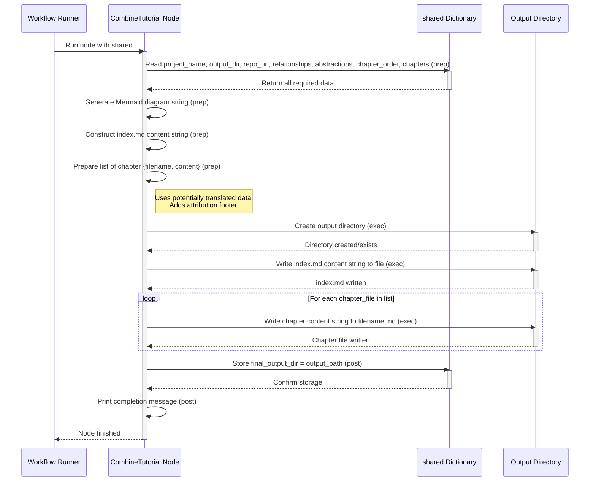

# Chapter 9: Tutorial Assembly


```markdown
# Chapter 9: Tutorial Assembly

We've reached the final step! In the previous chapter, [Chapter Content Generation](08_chapter_content_generation_.md), our automated technical writer diligently drafted the content for each chapter of our tutorial, following the plan laid out in [Chapter Ordering Logic](07_chapter_ordering_logic_.md). We now have a collection of individual Markdown files, each explaining a core concept of the target codebase.

But these are just loose pages! How do we turn these separate drafts into a polished, final tutorial that someone can actually navigate and read? This is where the **Tutorial Assembly** step comes in.

## What Problem Does This Solve?

Imagine you've written all the chapters for a book. You have Chapter 1, Chapter 2, Chapter 3, and so on, as separate documents. What's missing?

*   **A Cover Page & Table of Contents:** Readers need a starting point. They need an overview of the project (like a book's blurb) and a list of chapters to easily find what they're looking for.
*   **Visual Structure:** It's often helpful to see a map of how the main ideas (chapters) relate to each other.
*   **The Final "Binding":** All these files need to be organized neatly in one place (a folder) so the reader receives a complete, coherent package.

The **Tutorial Assembly** step acts like the **publisher** receiving the final chapter drafts. The publisher adds a title page (`index.md`), includes the project summary and a relationship diagram, creates the table of contents (linking to the chapter files), and then "binds" everything together by saving all the files into the designated output folder.

## The Publisher Analogy

Think of this final step like the publishing house getting ready to print a book:
1.  They receive all the written and edited chapters (our generated Markdown content from `shared['chapters']`).
2.  They take the author's summary (our project `summary` from [Chapter 6: Relationship Analysis](06_relationship_analysis_.md)).
3.  They might create a visual diagram showing how characters or plot points connect (our relationship `Mermaid` diagram).
4.  They design the **Table of Contents** page (`index.md`), listing all the chapters in order ([Chapter Ordering Logic](07_chapter_ordering_logic_.md)) and linking to the corresponding page numbers (our chapter filenames).
5.  Finally, they print and bind everything into the finished book and ship it (save all files to the `output_dir`).

This node takes all the pieces generated in previous steps and assembles the final, user-ready tutorial package.

## How it Works: The `CombineTutorial` Node

The very last node in our [Workflow Orchestration](03_workflow_orchestration_.md) is `CombineTutorial`. This node handles the final assembly and saving process.

Here’s how it works:

**1. Gathering All the Pieces (`prep` step):**

Before assembling anything, the `CombineTutorial` node gathers all the necessary components from the `shared` dictionary:

*   `shared['project_name']`: The name of the project being documented.
*   `shared['output_dir']`: The folder where the final tutorial should be saved (e.g., `output/my_cool_project`).
*   `shared['repo_url']`: The source repository URL (if provided).
*   `shared['relationships']`: The dictionary containing the project `summary` and the `details` of how abstractions connect (potentially translated).
*   `shared['abstractions']`: The list of abstractions, including their (potentially translated) `name` and `description`.
*   `shared['chapter_order']`: The list of abstraction indices defining the chapter sequence.
*   `shared['chapters']`: The list of generated Markdown strings, one for each chapter (potentially translated).

With these ingredients, the `prep` step *constructs* the content for the main `index.md` file **in memory**:
*   It generates a **Mermaid flowchart** diagram string visualizing the relationships between abstractions (using the potentially translated names and labels).
*   It writes the main `index.md` content, including:
    *   The project title.
    *   The project `summary` (potentially translated).
    *   The link to the source repository.
    *   The generated Mermaid diagram.
    *   A "Chapters" section acting as a table of contents, listing each chapter with its (potentially translated) name and a Markdown link to its corresponding filename (e.g., `1. [Configuration & Execution Entrypoint](01_configuration___execution_entrypoint_.md)`).
*   It prepares a list (`chapter_files`) where each entry contains the calculated `filename` for a chapter and its full Markdown `content` (taken from `shared['chapters']`). It also adds a standard attribution footer to each chapter's content string.

```python
# File: nodes.py (Inside CombineTutorial class - Simplified prep)

    def prep(self, shared):
        project_name = shared["project_name"]
        output_base_dir = shared.get("output_dir", "output")
        output_path = os.path.join(output_base_dir, project_name) # e.g., output/my_project
        repo_url = shared.get("repo_url")

        # Get potentially translated data
        relationships_data = shared["relationships"] # Has summary, details (labels might be translated)
        chapter_order = shared["chapter_order"]
        abstractions = shared["abstractions"] # Has name, description (might be translated)
        chapters_content = shared["chapters"] # List of Markdown strings (might be translated)

        # --- Generate Mermaid Diagram string ---
        mermaid_lines = ["flowchart TD"]
        # Add nodes (using potentially translated names)
        for i, abstr in enumerate(abstractions):
            node_id = f"A{i}"
            node_label = abstr["name"].replace('"', "") # Use potentially translated name
            mermaid_lines.append(f'    {node_id}["{node_label}"]')
        # Add edges (using potentially translated labels)
        for rel in relationships_data["details"]:
            edge_label = rel["label"].replace('"', "").replace("\n", " ") # Use potentially translated label
            mermaid_lines.append(f'    A{rel["from"]} -- "{edge_label}" --> A{rel["to"]}')
        mermaid_diagram = "\n".join(mermaid_lines)
        # --- End Mermaid ---

        # --- Prepare index.md content string ---
        index_content = f"# Tutorial: {project_name}\n\n"
        index_content += f"{relationships_data['summary']}\n\n" # Use potentially translated summary
        index_content += f"**Source Repository:** [{repo_url}]({repo_url})\n\n" # Fixed English string
        index_content += "```mermaid\n" + mermaid_diagram + "\n```\n\n"
        index_content += f"## Chapters\n\n" # Fixed English string

        chapter_files_to_write = [] # List of {'filename': str, 'content': str}
        # Generate chapter links and prepare chapter file data
        for i, abstraction_index in enumerate(chapter_order):
            if 0 <= abstraction_index < len(abstractions) and i < len(chapters_content):
                abstraction_name = abstractions[abstraction_index]["name"] # Potentially translated name
                safe_name = "".join(c if c.isalnum() else "_" for c in abstraction_name).lower()
                filename = f"{i+1:02d}_{safe_name}.md"
                index_content += f"{i+1}. [{abstraction_name}]({filename})\n" # Link uses potentially translated name

                # Get chapter content and add attribution footer
                chapter_markdown = chapters_content[i] # Potentially translated content
                footer = "\n\n---\n\nGenerated by [AI Codebase Knowledge Builder](https://github.com/The-Pocket/Tutorial-Codebase-Knowledge)" # Fixed English string
                chapter_markdown += footer

                chapter_files_to_write.append({"filename": filename, "content": chapter_markdown})
            # ... (error handling for mismatch) ...

        index_content += "\n\n---\n\nGenerated by [AI Codebase Knowledge Builder](https://github.com/The-Pocket/Tutorial-Codebase-Knowledge)" # Fixed English string for index

        return {
            "output_path": output_path,
            "index_content": index_content, # The complete string for index.md
            "chapter_files": chapter_files_to_write, # List of {filename, content} for chapters
        }
```

**2. Binding the Book (`exec` step):**

This step performs the actual file operations:
*   It takes the `output_path` prepared in the `prep` step (e.g., `output/my_cool_project`).
*   It creates this directory if it doesn't exist (`os.makedirs(output_path, exist_ok=True)`).
*   It writes the `index_content` string (generated in `prep`) to a file named `index.md` inside the output directory.
*   It iterates through the `chapter_files` list (also from `prep`) and writes each chapter's `content` string to its corresponding `filename` inside the output directory.

```python
# File: nodes.py (Inside CombineTutorial class - Simplified exec)

    def exec(self, prep_res):
        output_path = prep_res["output_path"]
        index_content = prep_res["index_content"]
        chapter_files = prep_res["chapter_files"]

        print(f"Combining tutorial into directory: {output_path}")
        # Create the output directory
        os.makedirs(output_path, exist_ok=True)

        # Write index.md
        index_filepath = os.path.join(output_path, "index.md")
        with open(index_filepath, "w", encoding="utf-8") as f:
            f.write(index_content)
        print(f"  - Wrote {index_filepath}")

        # Write each chapter file
        for chapter_info in chapter_files:
            chapter_filepath = os.path.join(output_path, chapter_info["filename"])
            with open(chapter_filepath, "w", encoding="utf-8") as f:
                f.write(chapter_info["content"])
            print(f"  - Wrote {chapter_filepath}")

        return output_path # Return the final path where files were saved
```

**3. Announcing Completion (`post` step):**

Finally, the `post` step takes the `output_path` returned by `exec` and stores it in the `shared` dictionary under the key `'final_output_dir'`. It also prints a confirmation message to the console, letting the user know where to find the generated tutorial.

```python
# File: nodes.py (Inside CombineTutorial class - Simplified post)

    def post(self, shared, prep_res, exec_res):
        # exec_res is the output_path returned by exec
        shared["final_output_dir"] = exec_res
        print(f"\nTutorial generation complete! Files are in: {exec_res}")
```

## Visualizing the Process

Here’s a sequence diagram illustrating the `CombineTutorial` node's actions:



This diagram shows the node gathering all the pieces, preparing the index and chapter file contents in memory, and then writing everything out to the specified directory on the file system.

## Conclusion

The **Tutorial Assembly** step, performed by the `CombineTutorial` node, is the final stage in our automated tutorial generation process. It acts as the **publisher**, taking all the generated components and producing the finished product. Its main responsibilities are:

1.  Gathering all necessary data from the `shared` dictionary (summaries, relationships, ordered chapters, content, configuration).
2.  Generating a **Mermaid relationship diagram** string.
3.  Constructing the **`index.md`** content string, including the project summary, diagram, and table of contents (using potentially translated names/summaries/labels).
4.  Preparing the final content for each chapter file, including adding an attribution footer.
5.  Creating the output directory and **writing** the `index.md` and all chapter `.md` files to disk.
6.  Storing the final output path and confirming completion.

And with that, the `PocketFlow-Tutorial-Codebase-Knowledge` project has successfully analyzed the codebase, structured a tutorial, written the content, and assembled the final files! You now have a complete, beginner-friendly tutorial ready to share.

This concludes our journey through the different components of the tutorial generator. We hope this step-by-step explanation has helped you understand how it works!
```

---

Generated by [AI Codebase Knowledge Builder](https://github.com/The-Pocket/Tutorial-Codebase-Knowledge)