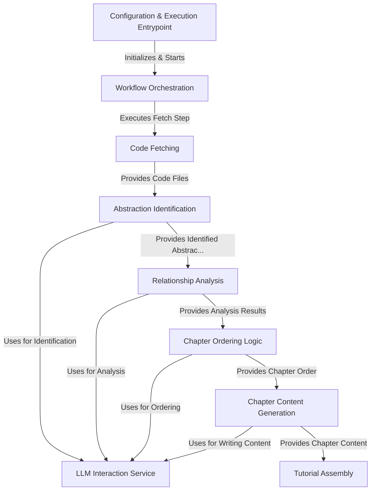

# Tutorial: PocketFlow-Tutorial-Codebase-Knowledge

This project acts as an *AI assistant* that automatically generates a **tutorial** for a software codebase. It takes a *GitHub repository* or a *local directory* as input, uses a **Large Language Model (LLM)** to analyze the code, identifies key *abstractions*, determines their relationships, orders them logically, and finally writes and assembles a multi-chapter **Markdown tutorial** to help developers understand the project structure and functionality.

**Source Repository:** [None](None)

## Chapters

1. [Configuration & Execution Entrypoint
](01_configuration___execution_entrypoint_.md)
2. [LLM Interaction Service
](02_llm_interaction_service_.md)
3. [Workflow Orchestration
](03_workflow_orchestration_.md)
4. [Code Fetching
](04_code_fetching_.md)
5. [Abstraction Identification
](05_abstraction_identification_.md)
6. [Relationship Analysis
](06_relationship_analysis_.md)
7. [Chapter Ordering Logic
](07_chapter_ordering_logic_.md)
8. [Chapter Content Generation
](08_chapter_content_generation_.md)
9. [Tutorial Assembly
](09_tutorial_assembly_.md)

---

Generated by [AI Codebase Knowledge Builder](https://github.com/The-Pocket/Tutorial-Codebase-Knowledge)