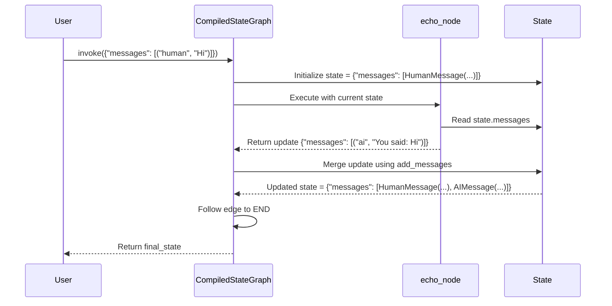

# Chapter 1: Graph / StateGraph

Welcome to LangGraph! If you want to build applications with language models (LLMs) that involve multiple steps or cycles, you're in the right place.

Imagine you want to build a chatbot. A user sends a message, the chatbot thinks, maybe uses a tool (like search), thinks some more, and finally responds. This isn't just one single action; it's a *sequence* of steps, potentially with loops and decisions. How do we organize this flow?

That's where the **Graph** comes in.

## What Problem Does a Graph Solve?

Think about building something complex, like assembling furniture or following a recipe. You have specific steps, and the order matters. Sometimes, you might repeat a step, or choose between different steps based on the situation.

LLM applications often work the same way:

1.  Get user input.
2.  Call an LLM to understand the input.
3.  *Maybe* call a tool (like a web search).
4.  Call the LLM again to generate a response based on the tool result.
5.  Show the response to the user.

Trying to code this as one giant function quickly becomes messy and hard to manage, especially if you add more tools, checks, or conversational memory.

`langgraph` provides a way to define these multi-step applications clearly using the concept of a **Graph**.

## Core Concepts: Graph vs. StateGraph

There are a few flavors of Graphs in LangGraph, but they all share the same basic idea.

1.  **`Graph` (The Basic Blueprint):**
    *   Think of this like a basic flowchart.
    *   It has **Nodes**: These are the individual steps or computations (like "call the LLM" or "use the search tool"). Each node is typically a Python function or a [LangChain Runnable](https://python.langchain.com/v0.2/docs/concepts/#langchain-expression-language-lcel).
    *   It has **Edges**: These are the connections or transitions *between* nodes. They define the possible paths through the flowchart (e.g., "after understanding the input, go to the search tool node").
    *   While fundamental, you'll more often use `StateGraph` for practical applications.

2.  **`StateGraph` (The Smart Blueprint):**
    *   This is the most common and powerful type you'll use. It's a specialized `Graph`.
    *   **Key Idea:** It introduces a central **State** object. Think of this state as a shared whiteboard or a structured piece of memory that all nodes can read from and write to.
    *   **How it works:** Each node receives the *current state*, performs its computation, and returns an *update* to the state. LangGraph automatically merges these updates into the shared state.
    *   **Why it's useful:** This is perfect for applications like chatbots where information (like the conversation history) needs to be carried along and updated throughout the process.

3.  **`MessageGraph` (Chatbot Specialist):**
    *   This is an even more specialized version of `StateGraph`.
    *   Its state is *always* a list of messages (like `AIMessage`, `HumanMessage`).
    *   It automatically handles adding new messages to the list. It's a convenient shortcut for building chat applications. We saw a glimpse of its `add_messages` function in the code snippets.

For this tutorial, we'll focus mainly on **`StateGraph`** as it's the most versatile.

## Building a (Very Simple) Workflow with `StateGraph`

Let's build the world's simplest "echo" bot. It will just take the user's message and add a response saying "You said: [user's message]".

**1. Define the State:**

What information needs to flow through our graph? Just the messages in the conversation. We'll use a Python `TypedDict` to define the structure of our state.

```python
from typing import Annotated, List
from typing_extensions import TypedDict
from langchain_core.messages import AnyMessage

# The `add_messages` function (seen in the code snippets)
# helps combine lists of messages. We'll cover how this
# works in detail in Chapter 2. For now, just know it
# manages our message list.
from langgraph.graph.message import add_messages

class AgentState(TypedDict):
    # The list of messages
    messages: Annotated[List[AnyMessage], add_messages]
```

*   **`TypedDict`**: A standard Python way to define dictionary-like structures with types.
*   **`messages`**: A key in our state dictionary that holds a list of messages.
*   **`Annotated[..., add_messages]`**: This is special syntax. It tells `StateGraph` that whenever a node returns a new message (or list of messages) for the `messages` key, it should use the `add_messages` function to append them to the existing list, rather than just overwriting it. We'll explore this annotation magic in [Chapter 2: State Schema & Channels
    ](02_state_schema___channels_.md).

**2. Define a Node:**

A node is just a function (or runnable) that takes the current state and returns updates.

```python
from langchain_core.messages import HumanMessage

# This is our first node. It simple echoes the user's message.
def echo_node(state: AgentState):
    last_message = state['messages'][-1]
    response_content = f"You said: {last_message.content}"
    # Return the update to the state. LangGraph knows to use
    # `add_messages` because of the annotation in AgentState.
    return {"messages": [("ai", response_content)]}
```

*   Our `echo_node` function takes the current `AgentState` dictionary.
*   It looks at the last message.
*   It returns a dictionary `{"messages": ...}`. This is the *update* to the state. `StateGraph` will handle merging this into the main `messages` list using `add_messages`.
*   Defining nodes is covered more in [Chapter 3: Nodes
    ](03_nodes_.md).

**3. Build the Graph:**

Now we assemble the blueprint using `StateGraph`.

```python
from langgraph.graph import StateGraph, END

# 1. Initialize the StateGraph with our AgentState
builder = StateGraph(AgentState)

# 2. Add our node
builder.add_node("echo", echo_node)

# 3. Define the entry point - where does the graph start?
builder.set_entry_point("echo")

# 4. Define the finish point - where does the graph end?
builder.set_finish_point("echo")

# 5. Compile the graph into a runnable object
app = builder.compile()
```

*   `StateGraph(AgentState)`: Creates a graph builder linked to our state definition.
*   `add_node("echo", echo_node)`: Registers our function `echo_node` under the name "echo".
*   `set_entry_point("echo")`: Tells the graph to start execution at the "echo" node.
*   `set_finish_point("echo")`: Tells the graph that after the "echo" node runs, the execution should stop (using the special `END` marker internally). Edges are detailed in [Chapter 4: Edges & Branches
    ](04_edges___branches_.md).
*   `compile()`: This is a crucial step. It takes our blueprint (the nodes and edges we defined) and transforms it into an executable application. We'll touch on the engine behind this in [Chapter 5: Pregel Execution Engine
    ](05_pregel_execution_engine_.md).

**4. Run the Graph:**

Now we can run our compiled application!

```python
# Define the initial input message from the user
initial_state = {"messages": [("human", "Hello there!")]}

# Invoke the graph
final_state = app.invoke(initial_state)

# Print the final state
print(final_state['messages'])
```

**Expected Output:**

```
[HumanMessage(content='Hello there!', id='...'), AIMessage(content='You said: Hello there!', id='...')]
```

It worked! The graph started at `echo_node`, the node read the initial `HumanMessage`, generated the AI response, and `StateGraph` used `add_messages` to append the `AIMessage` to the state.

## How Does `StateGraph` Work Internally? (A Peek)

You don't *need* to know the deep internals to use `StateGraph`, but a high-level understanding helps.

**The Blueprint Idea:**

When you use `builder.add_node()` and `builder.add_edge()`, you're not running any code yet. You're just *describing* the workflow – creating the blueprint.

```python
# From langgraph/graph/state.py (Simplified)
class StateGraph(Graph):
    def __init__(self, state_schema: Optional[type[Any]] = None, ...):
        super().__init__()
        self.schema = state_schema
        # ... stores channels based on schema ...

    def add_node(self, node: str, action: RunnableLike, ...):
        # ... stores the node name and its associated function/runnable ...
        self.nodes[node] = StateNodeSpec(runnable=coerce_to_runnable(action), ...)

    def add_edge(self, start_key: str, end_key: str):
        # ... stores the connection between nodes ...
        self.edges.add((start_key, end_key))
```

*   The `StateGraph` remembers the `state_schema` (like our `AgentState`).
*   `add_node` stores the node's name and the actual Python code to run.
*   `add_edge` stores the connections (like `START` -> "echo", "echo" -> `END`).

**Compilation:**

The `compile()` method is where the magic happens. It takes this blueprint and converts it into an optimized execution plan using an internal engine called "Pregel". Think of it like compiling high-level code into machine instructions.

```python
# From langgraph/graph/state.py (Conceptual)
class StateGraph(Graph):
    # ... (init, add_node, add_edge) ...

    def compile(self, ...):
        # 1. Validate the blueprint (nodes exist, edges connect properly)
        self.validate(...)

        # 2. Create a CompiledStateGraph (uses Pregel engine)
        compiled = CompiledStateGraph(builder=self, ...)

        # 3. Translate nodes/edges into Pregel's format
        for key, node_spec in self.nodes.items():
            compiled.attach_node(key, node_spec)
        for start, end in self.edges:
            compiled.attach_edge(start, end)
        # ... handle branches, entry/finish points ...

        # 4. Return the runnable compiled graph
        return compiled.validate()
```

This `CompiledStateGraph` knows exactly how to manage the state and execute the nodes in the right order based on the edges.

**Execution (`invoke`)**:

When you call `app.invoke(initial_state)`:

1.  The Pregel engine receives the initial state (`{"messages": [HumanMessage(...)]}`).
2.  It identifies the entry point ("echo").
3.  It prepares the state needed for the "echo" node (in this case, the full `AgentState`).
4.  It executes the `echo_node` function with that state.
5.  The `echo_node` returns the update `{"messages": [AIMessage(...)]}`.
6.  The engine uses the `add_messages` reducer (because of the `Annotated` type hint) to merge this update into the state. The state becomes `{"messages": [HumanMessage(...), AIMessage(...)]}`.
7.  It follows the edge from "echo" to `END`.
8.  Since it reached `END`, execution stops, and the final state is returned.

Here's a simplified sequence diagram:



This state management and execution flow is what makes `StateGraph` so useful for building complex, stateful applications.

## Conclusion

You've learned the fundamental concept in `langgraph`: the **Graph**, and its more powerful sibling, the **StateGraph**.

*   Graphs define the structure (nodes and edges) of your multi-step application, like a flowchart.
*   `StateGraph` adds a shared **State** that nodes read from and update, making it ideal for conversational AI and other stateful processes.
*   You build a graph by defining a state schema, adding nodes (functions/runnables), and connecting them with edges, before `compile()`-ing it into a runnable application.

This structure helps organize complex logic, making your LLM applications more robust and maintainable.

In the next chapter, we'll dive deeper into defining the `State` itself.

**Next:** [Chapter 2: State Schema & Channels
](02_state_schema___channels_.md)

---

Generated by [AI Codebase Knowledge Builder](https://github.com/The-Pocket/Tutorial-Codebase-Knowledge)