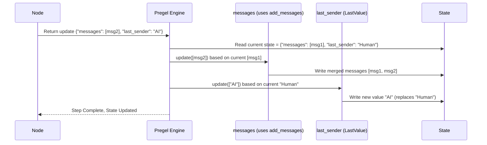

# Chapter 2: State Schema & Channels

In [Chapter 1: Graph / StateGraph](01_graph___stategraph_.md), we learned about `StateGraph` and how it uses a central **State** object to manage information flowing through the graph. We even defined a simple state for our echo bot:

```python
# From Chapter 1
from typing import Annotated, List
from typing_extensions import TypedDict
from langchain_core.messages import AnyMessage
from langgraph.graph.message import add_messages

class AgentState(TypedDict):
    messages: Annotated[List[AnyMessage], add_messages]
```

But what exactly *is* this `AgentState`? And what does `Annotated[..., add_messages]` do? Let's dive into the blueprint of our graph's memory: the **State Schema** and the underlying **Channels**.

## What Problem Does This Solve? Defining the Graph's Memory

Imagine our graph is like a mini-application with its own short-term memory. The **State** *is* that memory. But just like any computer program needs structured data, our graph needs a clear definition of what its memory looks like.

Furthermore, when different parts of our graph (the nodes) want to *update* this memory, how should those updates be combined?

*   If Node A adds a message and Node B adds another message, should the second message replace the first, or should they both be kept in a list?
*   If Node A calculates a score and Node B calculates another score, should we keep the latest score, add them together, or something else?

The **State Schema** defines the *structure* of the memory, and **Channels** (often configured using annotations like `Annotated`) define the *rules* for updating that memory.

## Key Concepts

Let's break down how `StateGraph` manages its state.

1.  **State Schema:**
    *   This is the **blueprint** for your graph's shared state. It tells LangGraph what pieces of information the state can hold and what their data types are.
    *   You typically define this using Python's `typing.TypedDict` or a `pydantic.BaseModel`. Think of it like defining the fields in a database table or the attributes of a class.
    *   **Analogy:** If the state is a shared whiteboard, the schema defines the sections on the board (e.g., "Messages", "User Info", "Scratchpad").

    ```python
    from typing_extensions import TypedDict
    from langchain_core.messages import AnyMessage

    # A simple schema with one key: 'messages'
    class BasicAgentState(TypedDict):
        messages: list[AnyMessage]
    ```
    *   This schema tells LangGraph that the state will be a dictionary with at least one key, `messages`, which holds a list of LangChain messages.

2.  **Channels:**
    *   **Internally**, for *each key* defined in your State Schema (like `messages`), LangGraph creates a **Channel**.
    *   Think of a Channel as the specific mechanism responsible for storing and updating the value associated with that key.
    *   There are different *types* of Channels, each with different update behavior. The default channel type typically just keeps the *last value* written to it.
    *   **Analogy:** If the schema is the whiteboard blueprint, each *section* on the whiteboard is managed by its own dedicated "Channel".

3.  **Annotations & Reducers (Update Rules):**
    *   How do we tell LangGraph *not* to use the default "last value wins" channel for a specific key? We use **annotations** in our schema definition.
    *   The most common way is using `typing.Annotated`. It lets you associate metadata with a type hint.
    *   `Annotated[<type>, <reducer_function>]`: This tells LangGraph: "For this key, use the specified `<type>`, but manage updates using this `<reducer_function>`."
    *   A **reducer function** is simply a function that takes the *current value* and the *new update(s)* and returns the *new combined value*. `add_messages` is a pre-built reducer provided by LangGraph specifically for lists of messages.
    *   **Analogy:** Annotations are like specific instructions written in a section of the whiteboard blueprint. For the "Messages" section, the instruction might be "Append new messages to the list", while for the "Last User Query" section, it might be "Erase the old query and write the new one".

## How to Use It: Defining State Update Rules

Let's revisit our `AgentState` from Chapter 1 and see how these concepts apply:

```python
from typing import Annotated, List
from typing_extensions import TypedDict
from langchain_core.messages import AnyMessage
from langgraph.graph.message import add_messages # The reducer function

class AgentState(TypedDict):
    # Key: 'messages'
    # Type: List of AnyMessage
    # Reducer: add_messages
    messages: Annotated[List[AnyMessage], add_messages]

    # Another key, with no special reducer
    last_sender: str
```

*   **`class AgentState(TypedDict):`**: We define our state schema using `TypedDict`.
*   **`messages: ...`**: We define a key named `messages`.
*   **`Annotated[List[AnyMessage], add_messages]`**: This is the core part.
    *   `List[AnyMessage]`: Specifies the data type – it holds a list of messages.
    *   `add_messages`: Specifies the **reducer**. When a node returns `{"messages": [new_message]}`, LangGraph won't just replace the old list. Instead, it will call `add_messages(current_messages_list, [new_message])` to get the updated list. `add_messages` intelligently appends or updates messages based on their IDs.
*   **`last_sender: str`**: We define another key `last_sender` of type `str`.
    *   Since there's no `Annotated` with a reducer here, LangGraph uses a default channel (typically `LastValue`). If a node returns `{"last_sender": "AI"}`, the previous value of `last_sender` will simply be overwritten.

**Example Interaction:**

Imagine the current state is:
`{"messages": [HumanMessage(content="Hi")], "last_sender": "Human"}`

A node runs and returns the update:
`{"messages": [AIMessage(content="Hello!")], "last_sender": "AI"}`

LangGraph processes this update:

1.  **For `messages`:** It sees the `add_messages` annotation. It calls `add_messages` with the current list `[HumanMessage(content="Hi")]` and the new list `[AIMessage(content="Hello!")]`. The result is `[HumanMessage(content="Hi"), AIMessage(content="Hello!")]`.
2.  **For `last_sender`:** It sees no special annotation. It uses the default "last value" behavior. The new value `"AI"` replaces the old value `"Human"`.

The final state becomes:
`{"messages": [HumanMessage(content="Hi"), AIMessage(content="Hello!")], "last_sender": "AI"}`

## How Does It Work Internally? (A Peek Under the Hood)

You don't need to know the deep details, but understanding the basics helps!

**1. Schema Parsing:**

When you create a `StateGraph(AgentState)`, LangGraph looks at your `AgentState` definition:

*   It iterates through the keys (`messages`, `last_sender`).
*   It uses Python's `get_type_hints` to inspect the type annotations.
*   If it finds `Annotated[<type>, <metadata>]`, it checks if `<metadata>` specifies a known channel type or a reducer function (like `add_messages`, or `operator.add`).
*   If no special annotation is found, it assigns a default channel type (like `LastValue`).

```python
# Simplified conceptual code from langgraph/graph/state.py

def _get_channels(schema: type[dict]):
    type_hints = get_type_hints(schema, include_extras=True)
    channels = {}
    managed = {}
    for name, typ in type_hints.items():
        if channel_or_managed := _get_channel(name, typ):
             if isinstance(channel_or_managed, BaseChannel):
                 channels[name] = channel_or_managed
             else: # It's a ManagedValueSpec
                 managed[name] = channel_or_managed
        # ... (handle other cases like __root__)
    return channels, managed, type_hints

def _get_channel(name: str, annotation: Any):
    # Check for Annotated[..., ManagedValueSpec] (covered later)
    if manager := _is_field_managed_value(name, annotation):
        return manager
    # Check for Annotated[..., BaseChannel instance or class]
    elif channel := _is_field_channel(annotation):
        channel.key = name
        return channel
    # Check for Annotated[..., binary_operator_func]
    elif channel := _is_field_binop(annotation): # Checks if metadata is callable(a,b)->c
        channel.key = name
        return channel
    # Default: Use LastValue channel
    fallback = LastValue(annotation)
    fallback.key = name
    return fallback

# add_messages is often handled via BinaryOperatorAggregate or a specialized channel
# internally depending on exact setup, but conceptually it fits the reducer pattern.
```

**2. Update Handling (During `invoke`):**

When a node finishes and returns an update dictionary (e.g., `{"messages": [...], "last_sender": "..."}`), the internal Pregel execution engine does the following for each key-value pair in the update:

1.  Finds the corresponding **Channel** object associated with the key (e.g., the `messages` channel, the `last_sender` channel).
2.  Calls the channel's `.update()` method, passing in the new value(s) from the node's return dictionary.
3.  The channel's `.update()` method contains the specific logic:
    *   The channel for `messages` (using `add_messages` logic) appends the new messages to its internal list.
    *   The channel for `last_sender` (a `LastValue` channel) simply replaces its internal value with the new one.
4.  The Pregel engine gathers the results from all channel updates to form the new overall state for the next step.

Here's a sequence diagram illustrating this:



Different channel types implement the `update` method differently:

*   `LastValue` (from `langgraph/channels/last_value.py`): Its `update` method just takes the last value from the input sequence and stores it, overwriting the previous value.
*   `BinaryOperatorAggregate` (from `langgraph/channels/binop.py`): Its `update` method takes the current value and applies the provided binary function (like `operator.add`) cumulatively with all new values. `add_messages` behaves similarly for lists of messages.
*   `Topic` (from `langgraph/channels/topic.py`): Can accumulate all values received across steps or reset each step.

By choosing or defining the right channel or reducer via annotations, you gain precise control over how your graph's state evolves.

## Conclusion

You've now learned how to define the structure and update rules for your graph's memory using the **State Schema** and **Channels/Annotations**.

*   The **State Schema** (e.g., `TypedDict`) acts as the blueprint for the shared state.
*   **Channels** are the internal managers for each piece of state.
*   **Annotations** (like `Annotated[..., add_messages]`) allow you to specify *how* updates to a specific state key should be merged, overriding the default "last value wins" behavior.

This mechanism is crucial for building stateful applications, especially conversational agents where you need to accumulate history (`add_messages`) or manage other pieces of information according to specific rules.

Now that we understand how to structure the state, let's look more closely at the building blocks that *operate* on this state.

**Next:** [Chapter 3: Nodes](03_nodes_.md)

---

Generated by [AI Codebase Knowledge Builder](https://github.com/The-Pocket/Tutorial-Codebase-Knowledge)