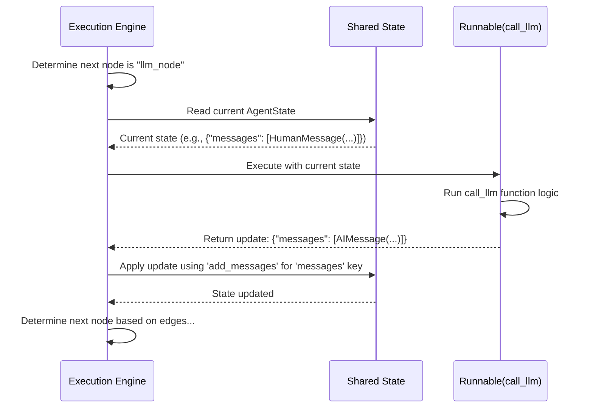

# Chapter 3: Nodes

In [Chapter 2: State Schema & Channels](02_state_schema___channels_.md), we learned how to define the structure and update rules for our graph's shared memory (the **State**). But how do we actually *do* anything with that state? How does the graph perform calculations, call models, or interact with tools?

That's where **Nodes** come in.

## What Problem Do Nodes Solve? The Workers of the Graph

Imagine our graph is like an assembly line for processing information. The **State** is the object being assembled, moving down the line. The **Nodes** are the workers stationed at different points along the line. Each worker (node) performs a specific task:

*   One worker might inspect the object (read the state).
*   Another might add a part (update the state by calling an LLM).
*   Yet another might polish it (format the output).

Without these workers (nodes), the assembly line (graph) wouldn't actually *do* anything. Nodes are the units of computation within the graph.

## Key Concept: Nodes as Functions

In `langgraph`, a node is typically just a regular Python **function** (or a [LangChain Runnable](https://python.langchain.com/v0.2/docs/concepts/#langchain-expression-language-lcel)).

*   **Input:** This function takes the current **State** of the graph as its input (usually as a dictionary or a custom object like our `AgentState` from previous chapters).
*   **Action:** Inside the function, you write Python code to perform a specific task. This could be anything:
    *   Calling a language model (LLM).
    *   Querying a database.
    *   Using a tool (like web search).
    *   Making a decision based on the state.
    *   Just doing some data manipulation.
*   **Output:** The function returns a dictionary. This dictionary represents the **updates** to be applied to the shared State. LangGraph takes care of merging these updates based on the rules defined in your [State Schema & Channels](02_state_schema___channels_.md).

Think of it like this:

```
Node Function(Current State) -> Returns {Updates to State}
```

## How to Use It: Defining and Adding Nodes

Let's continue with our simple chatbot idea. We have our `AgentState` from the previous chapters:

```python
# State definition from Chapter 1 & 2
from typing import Annotated, List
from typing_extensions import TypedDict
from langchain_core.messages import AnyMessage, HumanMessage, AIMessage
from langgraph.graph.message import add_messages

class AgentState(TypedDict):
    messages: Annotated[List[AnyMessage], add_messages]
```

Now, let's define a node that represents the Language Model making a call. This node will look at the last message and generate a simple response.

**1. Define the Node Function:**

```python
# Define a function that represents a "worker" node
def call_llm(state: AgentState):
    """Calls a dummy LLM to generate a response."""
    current_messages = state['messages']
    last_message = current_messages[-1].content
    print(f"Node 'call_llm': Processing message '{last_message}'")

    # Simulate LLM call
    response_content = f"LLM says: I received '{last_message}'!"
    new_ai_message = AIMessage(content=response_content)

    # Return the update for the 'messages' state key
    return {"messages": [new_ai_message]}
```

*   `def call_llm(state: AgentState):`: Defines a regular Python function named `call_llm`. It takes one argument, `state`, which will be the current `AgentState` dictionary.
*   `state['messages']`: Accesses the list of messages from the current state.
*   `print(...)`: Just to show when the node runs.
*   `response_content = ...`: Simulates the logic (e.g., calling an actual LLM).
*   `return {"messages": [new_ai_message]}`: This is crucial! It returns a dictionary specifying which part of the state to update (`messages`) and the new value(s) to add. Because `messages` is annotated with `add_messages` in our `AgentState`, LangGraph will append this `AIMessage` to the list.

**2. Add the Node to the Graph:**

Now we need to tell our `StateGraph` about this worker.

```python
from langgraph.graph import StateGraph

# Create a graph builder instance
builder = StateGraph(AgentState)

# Add the function 'call_llm' as a node named "llm_node"
builder.add_node("llm_node", call_llm)

print("Node 'llm_node' added to the graph builder.")
```

*   `builder = StateGraph(AgentState)`: We initialize our graph builder, linking it to our state definition (as seen in [Chapter 1: Graph / StateGraph](01_graph___stategraph_.md)).
*   `builder.add_node("llm_node", call_llm)`: This registers our `call_llm` function with the graph.
    *   `"llm_node"`: This is the unique *name* we give this node within the graph. We'll use this name later to connect nodes with edges.
    *   `call_llm`: This is the actual Python function that will be executed when the graph reaches this node.

That's it! We've defined a task (the function) and registered it as a worker (node) in our graph blueprint. Later, in [Chapter 4: Edges & Branches](04_edges___branches_.md), we'll see how to connect this node to others to define the flow of work.

## How Does It Work Internally? (A Peek)

When you call `builder.add_node("llm_node", call_llm)`, LangGraph doesn't run the `call_llm` function immediately. It simply stores the information in its blueprint.

**Storing the Blueprint:**

Internally, the `StateGraph` builder object maintains a dictionary of nodes. Adding a node essentially adds an entry to this dictionary.

```python
# Simplified conceptual code from langgraph/graph/state.py

class StateGraph(Graph):
    def __init__(self, state_schema, ...):
        super().__init__()
        self.nodes = {} # Stores node information
        self.schema = state_schema
        # ... other setup ...

    def add_node(self, node_name: str, action: Callable):
        # ... performs checks (name exists, reserved names etc.) ...

        # Store the node name and the function/runnable to execute
        # along with other specs like input schema etc.
        self.nodes[node_name] = StateNodeSpec(
            runnable=coerce_to_runnable(action, ...), # Converts function to Runnable
            metadata=None,
            input=self.schema, # Default input is the graph's state
            # ... other node properties ...
        )
        print(f"Internal: Stored blueprint for node '{node_name}'")
        return self
```

*   The `add_node` method takes the `node_name` (string) and the `action` (our `call_llm` function).
*   It performs some validation checks.
*   It uses `coerce_to_runnable` to wrap our function into a standard LangChain Runnable interface. This allows LangGraph to treat functions, Runnables, etc., uniformly.
*   It stores this runnable object, along with the node's name and other configuration (like which state schema it expects), in the `self.nodes` dictionary.

**Execution Flow (Simplified):**

When you eventually `compile()` the graph and `invoke()` it (covered more in later chapters), the execution engine (Pregel) uses this stored blueprint:

1.  **Identify Next Node:** Based on the graph's edges, the engine determines that `"llm_node"` should run next.
2.  **Prepare Input:** The engine retrieves the *current* `AgentState` from the graph's shared memory.
3.  **Execute Node:** It looks up `"llm_node"` in its internal registry and finds the associated runnable (wrapping our `call_llm` function). It then executes this runnable, passing the current `AgentState` as input.
4.  **Receive Update:** Our `call_llm` function runs and returns the update dictionary `{"messages": [AIMessage(...)]}`.
5.  **Update State:** The engine takes this update dictionary. It looks at the `AgentState` schema and sees that the `messages` key uses the `add_messages` reducer (from [Chapter 2: State Schema & Channels](02_state_schema___channels_.md)). It uses this reducer to merge the new `AIMessage` into the existing list in the shared state.
6.  **Proceed:** The engine then determines the *next* node based on the graph's edges.

Here's a simplified sequence diagram:



This process ensures that each node performs its specific task using the latest state and contributes its results back to the shared state according to the defined rules.

## Conclusion

You've learned about **Nodes**, the fundamental units of work in `langgraph`.

*   Nodes are like workers on an assembly line, each performing a specific computation.
*   They are typically implemented as Python **functions** that take the current **State** and return a dictionary of **updates**.
*   You add nodes to your graph blueprint using `builder.add_node("node_name", function_or_runnable)`.
*   LangGraph's execution engine calls these node functions at the right time and merges their returned updates into the shared state.

With the state defined (Chapter 2) and the workers ready (Nodes), we now need to define the flow of work between them. How does the output of one node lead to the input of another? That's the job of edges and branches.

**Next:** [Chapter 4: Edges & Branches](04_edges___branches_.md)

---

Generated by [AI Codebase Knowledge Builder](https://github.com/The-Pocket/Tutorial-Codebase-Knowledge)