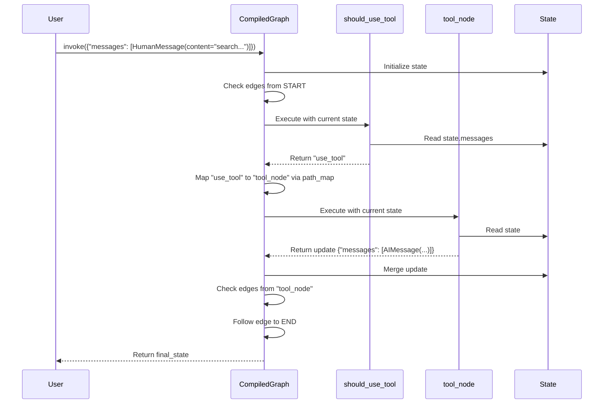

# Chapter 4: Edges & Branches

In [Chapter 3: Nodes](03_nodes_.md), we learned how to create the "workers" of our graph – the nodes that perform actions using the shared state. Now we have these workers ready, but how do we tell them who works after whom? How does the information flow from one worker to the next?

That's where **Edges** and **Branches** come in. They define the connections and the decision-making logic within our graph.

## What Problem Do Edges & Branches Solve? Defining the Workflow

Imagine our graph is like a railway system. The **Nodes** are the stations where specific tasks happen. The **Edges** are the railway tracks connecting these stations.

*   Sometimes, the track goes directly from Station A to Station B. This is a **simple edge**.
*   Other times, you arrive at Station A, and there's a switch operator who looks at your ticket (the current state or node output) and decides whether to send your train down the track to Station B or the track to Station C. This is a **conditional edge**, managed by a **Branch**.

Edges and Branches define the **control flow** – the path the execution takes through the graph. Without them, our nodes would be isolated stations with no way to reach them or leave them.

**Use Case:** Let's imagine we want our simple chatbot to decide: if the user asks a question that needs external info (e.g., contains the word "search"), it should use a (dummy) search tool; otherwise, it should just generate a standard response.

## Key Concepts

1.  **Simple Edges (`add_edge`, `set_entry_point`, `set_finish_point`)**
    *   These are direct, fixed connections. "After *this* node, *always* go to *that* node."
    *   `builder.add_edge("node_A", "node_B")` creates a track from station A to station B.
    *   `builder.set_entry_point("node_A")` is a shortcut for `builder.add_edge(START, "node_A")`. It defines the first station the train visits. (`START` is a special keyword).
    *   `builder.set_finish_point("node_B")` is a shortcut for `builder.add_edge("node_B", END)`. It defines a station where the journey ends. (`END` is another special keyword).
    *   **Analogy:** A straight railway track with no switches.

2.  **Conditional Edges (`add_conditional_edges`) & Branches**
    *   These introduce decision points. "After *this* node, run this *decision logic* (the Branch) to choose the *next* node(s)."
    *   **Branch Function:** This is a Python function you write. It takes the current `state` as input and returns the *name* (or a list of names) of the next node(s) to execute.
    *   **`path_map` (Optional):** Sometimes, your branch function might return a general outcome like `"use_tool"` or `"respond"`. The `path_map` is a dictionary that translates these outcomes into the actual node names defined in your graph (e.g., `{"use_tool": "search_node", "respond": "llm_node"}`).
    *   **`END`:** Your branch function can return the special `END` keyword to signify that the graph execution should stop.
    *   **Analogy:** The railway switch and the operator who decides which track to take based on the train's destination or cargo.

## How to Use It: Connecting Our Nodes

Let's build our simple decision-making agent.

**1. Setup (State and Nodes):**

First, let's define our state and two dummy nodes from [Chapter 3: Nodes](03_nodes_.md): one for using a tool and one for a standard action.

```python
from typing import Annotated, List, TypedDict
from langchain_core.messages import AnyMessage, HumanMessage, AIMessage
from langgraph.graph import StateGraph, END
from langgraph.graph.message import add_messages

# 1. Define the State
class AgentState(TypedDict):
    messages: Annotated[List[AnyMessage], add_messages]

# 2. Define Nodes
def call_tool(state: AgentState):
    print("Node: call_tool")
    # Simulate using a tool
    return {"messages": [AIMessage(content="Tool says: Found results!")]}

def take_action(state: AgentState):
    print("Node: take_action")
    # Simulate a regular action
    return {"messages": [AIMessage(content="Action says: Okay!")]}

# 3. Initialize the graph builder
builder = StateGraph(AgentState)
builder.add_node("tool_node", call_tool)
builder.add_node("action_node", take_action)
```

*   We have our `AgentState` to hold messages.
*   We have `call_tool` and `take_action` nodes.
*   We add these nodes to our `builder`.

**2. Setting Entry and Finish Points (Simple Edges):**

Where does the graph start, and where do the individual paths end?

```python
# We'll set the entry point later using a conditional edge.

# Let's say after either node runs, the graph should end.
builder.add_edge("tool_node", END)
builder.add_edge("action_node", END)

# You could also use builder.set_finish_point("tool_node")
# if only that node could end the graph.
```

*   `builder.add_edge("tool_node", END)`: Creates a simple edge. After `tool_node` runs, the graph stops.
*   `builder.add_edge("action_node", END)`: After `action_node` runs, the graph stops.

**3. Adding a Conditional Edge (The Decision):**

Now, let's add the logic to choose *between* `tool_node` and `action_node` based on the user's last message.

```python
# Define the Branch Function
def should_use_tool(state: AgentState) -> str:
    """Decides whether to use the tool or take a standard action."""
    print("Branch: should_use_tool")
    last_message = state['messages'][-1].content
    if "search" in last_message.lower():
        print("Decision: Use Tool")
        return "use_tool" # Output matches a key in path_map
    else:
        print("Decision: Take Action")
        return "take_action" # Output matches a key in path_map

# Add the conditional edge
builder.add_conditional_edges(
    START, # Start the decision right after the graph entry
    should_use_tool, # The function that makes the decision
    {
        # Map the function's outputs to actual node names
        "use_tool": "tool_node",
        "take_action": "action_node"
    }
)
```

*   `should_use_tool(state)`: This function takes the state, checks the last message, and returns a string: `"use_tool"` or `"take_action"`.
*   `builder.add_conditional_edges(...)`: This connects the special `START` point (the graph's entry) to our decision logic.
    *   `START`: The source "node" for this decision (meaning it happens right at the beginning).
    *   `should_use_tool`: The branch function to call.
    *   `{...}`: The `path_map`. If `should_use_tool` returns `"use_tool"`, the graph goes to `"tool_node"`. If it returns `"take_action"`, it goes to `"action_node"`.

**4. Compile and Run:**

Let's compile the graph and see it in action.

```python
# Compile the graph
app = builder.compile()

# Run with input that triggers the tool
input1 = {"messages": [HumanMessage(content="Please search for cats")]}
print("\n--- Run 1: Tool Path ---")
for event in app.stream(input1):
    print(event)

# Run with input that triggers the action
input2 = {"messages": [HumanMessage(content="Hello there")]}
print("\n--- Run 2: Action Path ---")
for event in app.stream(input2):
    print(event)
```

**Expected Output (Simplified):**

```
--- Run 1: Tool Path ---
Branch: should_use_tool
Decision: Use Tool
{'tool_node': {'messages': [AIMessage(content='Tool says: Found results!')]}}
{'__end__': {'messages': [HumanMessage(content='Please search for cats'), AIMessage(content='Tool says: Found results!')]}}

--- Run 2: Action Path ---
Branch: should_use_tool
Decision: Take Action
{'action_node': {'messages': [AIMessage(content='Action says: Okay!')]}}
{'__end__': {'messages': [HumanMessage(content='Hello there'), AIMessage(content='Action says: Okay!')]}}
```

It works! The `add_conditional_edges` successfully used our `should_use_tool` function to route the execution to the correct node based on the input message.

## How It Works Internally? (A Peek)

**Blueprint Storage:**

*   `builder.add_edge("node_A", "node_B")`: Stores the tuple `("node_A", "node_B")` in a set called `self.edges` within the `Graph` object (`graph/graph.py`).
*   `builder.add_conditional_edges("node_A", should_use_tool, path_map)`:
    1.  Wraps your `should_use_tool` function into a standard LangChain Runnable.
    2.  Creates a `Branch` object (`graph/branch.py`) storing this runnable, the `path_map`, and the source node name (`"node_A"`).
    3.  Stores this `Branch` object in a dictionary `self.branches`, keyed by the source node name (`self.branches["node_A"] = { "condition_name": branch_object }`).

```python
# Simplified conceptual code from graph/graph.py

class Graph:
    def __init__(self):
        self.nodes = {}
        self.edges = set() # Stores simple edges like ("node_A", "node_B")
        self.branches = defaultdict(dict) # Stores conditional edges
        # ...

    def add_edge(self, start_key: str, end_key: str):
        # ... validation ...
        self.edges.add((start_key, end_key))
        # ...

    def add_conditional_edges(self, source, path, path_map=None, ...):
        # ... validation ...
        path_runnable = coerce_to_runnable(path, ...) # Wrap function
        name = path_runnable.name or "condition"
        # Create and store the Branch configuration
        self.branches[source][name] = Branch.from_path(path_runnable, path_map, ...)
        # ...
```

**Execution Flow (Simplified):**

When you `compile()` and `invoke()`/`stream()` the graph, the Pregel execution engine handles the flow:

1.  **Engine Starts:** Receives initial input.
2.  **Check Entry:** Looks for edges starting from `START`. Finds the conditional edge we added.
3.  **Execute Branch Function:** Calls the `should_use_tool` runnable, passing the current `AgentState`.
4.  **Get Destination:** The function returns a destination string (e.g., `"use_tool"`).
5.  **Map Destination:** The engine uses the stored `path_map` associated with this branch to translate `"use_tool"` to the actual node name `"tool_node"`.
6.  **Schedule Next Node:** The engine schedules `"tool_node"` to run next.
7.  **Execute Node:** Runs the `call_tool` function associated with `"tool_node"`. The node updates the state.
8.  **Check Edges from Node:** After `"tool_node"` finishes, the engine looks for edges starting from `"tool_node"`. It finds the simple edge `("tool_node", END)`.
9.  **Reach END:** The engine sees the `END` destination and stops execution, returning the final state.

Here's a sequence diagram illustrating the conditional flow:



This combination of simple and conditional edges allows you to build complex, dynamic workflows.

## Conclusion

You've now learned how to connect the workers (Nodes) in your graph using **Edges** and **Branches**.

*   **Simple Edges (`add_edge`)** define fixed paths: "Always go here next."
*   **Conditional Edges (`add_conditional_edges`)** use a **Branch function** to make decisions based on the current state, choosing the next path dynamically, often using a `path_map` to link decision outcomes to node names.
*   The special `START` and `END` markers define the graph's entry and exit points.

With state, nodes, and edges/branches, we have the core components of a LangGraph application blueprint. But how does LangGraph actually *run* this blueprint efficiently, handling the state updates and node executions? That's the job of the underlying execution engine.

**Next:** [Chapter 5: Pregel Execution Engine](05_pregel_execution_engine_.md)

---

Generated by [AI Codebase Knowledge Builder](https://github.com/The-Pocket/Tutorial-Codebase-Knowledge)