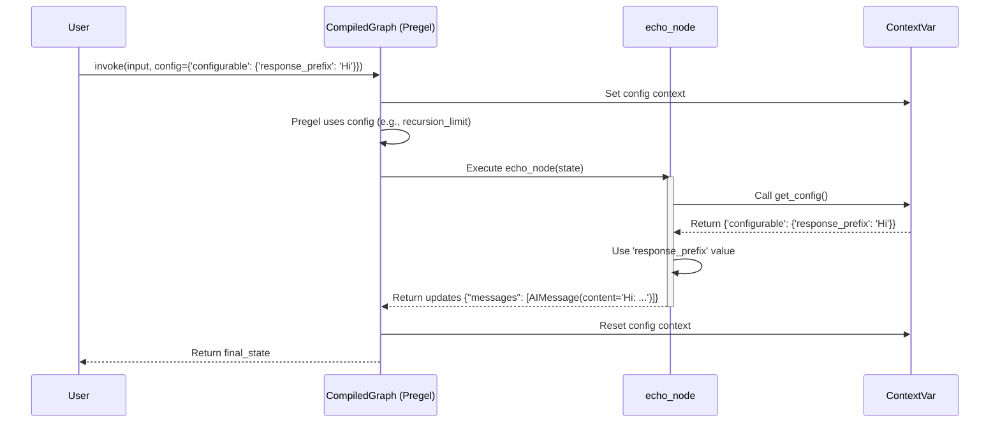

# Chapter 6: RunnableConfig

In [Chapter 5: Pregel Execution Engine](05_pregel_execution_engine_.md), we saw the powerful engine that drives our graph's execution step-by-step. But how do we control *how* that engine runs for a specific invocation? What if we need to tell the graph which user's conversation we're continuing, set safety limits, or provide API keys?

This is where **RunnableConfig** comes in.

## What Problem Does RunnableConfig Solve? Configuring the Graph's Run

Imagine your graph is like a powerful command-line tool. Sometimes you run it with default settings, but often you want to provide specific options:

*   Specify the input file (`--input data.txt`).
*   Set a maximum runtime (`--timeout 60s`).
*   Enable verbose logging (`--verbose`).
*   Pass a secret key (`--api-key XXXXX`).

**RunnableConfig** is the standard way to provide these kinds of "command-line arguments" or "settings" to your LangGraph graph when you run it using methods like `invoke()`, `stream()`, or `batch()`. It's a dictionary that holds crucial runtime information needed by the graph or its components.

**Use Case:** Let's say we're building our chatbot. For each user request, we need to:

1.  Tell the graph *which conversation* this request belongs to, so it can load the correct history ([Chapter 7: Checkpoints](07_checkpoints_.md) will heavily rely on this).
2.  Maybe limit how many back-and-forth steps the graph can take to prevent infinite loops.
3.  Potentially pass an API key needed by one of the nodes.

`RunnableConfig` is how we pass all this information during the `invoke` or `stream` call.

## Key Concepts

1.  **It's a Dictionary:** At its core, `RunnableConfig` is just a Python dictionary. You pass it as the `config` argument when calling your compiled graph.

    ```python
    # Conceptual example
    app.invoke(
        {"messages": [("human", "Hi!")]},
        config={"recursion_limit": 10} # This is a RunnableConfig
    )
    ```

2.  **Standard LangChain:** `RunnableConfig` isn't unique to LangGraph. It's the standard configuration object used throughout the LangChain ecosystem for all [Runnables](https://python.langchain.com/v0.2/docs/concepts/#langchain-expression-language-lcel). LangGraph builds upon this standard.

3.  **The `configurable` Key:** Many important LangGraph settings are nested inside a special key within the config dictionary called `"configurable"`. Think of this as the dedicated section for LangGraph-specific runtime options.

    ```python
    config = {
        "recursion_limit": 15, # Standard Runnable setting
        "configurable": {      # LangGraph specific settings often go here
            "thread_id": "user_123_conversation_456",
            # API keys, custom parameters etc. can also go here
            "openai_api_key": "sk-..."
        }
    }
    app.invoke(..., config=config)
    ```

4.  **Common Configuration Options:**
    *   **`recursion_limit` (int):** Sets the maximum number of steps the [Pregel Execution Engine](05_pregel_execution_engine_.md) can take. Defaults to 25. Prevents accidental infinite loops.
    *   **`configurable["thread_id"]` (str):** A unique identifier for a particular run or conversation thread. Absolutely crucial for saving and loading the state using [Chapter 7: Checkpoints](07_checkpoints_.md).
    *   **`configurable["checkpoint_id"]` (str):** Tells the graph exactly which saved checkpoint to resume from.
    *   **`callbacks` (list):** A list of callback handlers for tracing and logging, often used with tools like LangSmith to monitor your graph's execution.
    *   **Custom Keys in `configurable`:** You can add your own keys inside `"configurable"` to pass arbitrary data (like API keys, user preferences, session IDs) that your [Nodes](03_nodes_.md) might need access to during the run.

## How to Use It: Passing Configuration

Let's reuse our simple echo bot from [Chapter 1: Graph / StateGraph](01_graph___stategraph_.md) and see how to pass configuration.

**1. The Graph (Recap):**

```python
from typing import Annotated, List
from typing_extensions import TypedDict
from langchain_core.messages import AnyMessage
from langgraph.graph import StateGraph, END
from langgraph.graph.message import add_messages

# 1. State
class AgentState(TypedDict):
    messages: Annotated[List[AnyMessage], add_messages]

# 2. Node
def echo_node(state: AgentState):
    last_message = state['messages'][-1]
    # Let's pretend we use a config value here
    from langgraph.config import get_config # Helper to access config
    config = get_config()
    prefix = config.get("configurable", {}).get("response_prefix", "Echo")
    response = f"{prefix}: {last_message.content}"
    return {"messages": [("ai", response)]}

# 3. Graph
builder = StateGraph(AgentState)
builder.add_node("echo", echo_node)
builder.set_entry_point("echo")
builder.set_finish_point("echo")
app = builder.compile()
```

*   We added `from langgraph.config import get_config` inside the node. This function lets nodes access the `RunnableConfig` passed during invocation.
*   We read an optional `"response_prefix"` from the configuration.

**2. Invoking with Config:**

Now let's call `invoke` with different configurations.

*   **Example 1: Setting `recursion_limit` and `thread_id`**

    ```python
    config_1 = {
        "recursion_limit": 5,  # Max 5 steps (our echo bot only takes 1)
        "configurable": {
            "thread_id": "echo_conversation_1"
            # We'll see why thread_id is important in Chapter 7
        }
    }

    input_data = {"messages": [("human", "Hello Config!")]}
    result = app.invoke(input_data, config=config_1)
    print(result['messages'][-1])
    ```

    *Output:*
    ```
    AIMessage(content='Echo: Hello Config!', id='...')
    ```
    *Explanation:* The graph ran normally. The `recursion_limit` wasn't hit. The `thread_id` was passed internally (useful for checkpoints later). Since we didn't provide `response_prefix`, the node used the default "Echo".

*   **Example 2: Providing a Custom Configurable Value**

    ```python
    config_2 = {
        "configurable": {
            "thread_id": "echo_conversation_2",
            "response_prefix": "CustomEcho" # Our custom value
        }
    }

    input_data = {"messages": [("human", "Custom Prefix Test")]}
    result = app.invoke(input_data, config=config_2)
    print(result['messages'][-1])
    ```

    *Output:*
    ```
    AIMessage(content='CustomEcho: Custom Prefix Test', id='...')
    ```
    *Explanation:* This time, the `echo_node` used `get_config()` to find the `"response_prefix"` we provided in the `configurable` dictionary and used it in the response.

## How It Works Internally? (A Peek)

**Passing the Dictionary Down:**

When you call `app.invoke(input, config=...)`, the `config` dictionary isn't just used once. It's passed down through the layers of LangChain and LangGraph:

1.  The top-level `invoke` method receives the config.
2.  It passes it to the underlying [Chapter 5: Pregel Execution Engine](05_pregel_execution_engine_.md).
3.  The Pregel engine uses certain keys from the config (especially from `configurable`, like `thread_id`, `checkpoint_id`, `recursion_limit`) to manage its own execution loop and state persistence (interacting with the checkpointer if configured).
4.  When Pregel decides to run a specific [Node](03_nodes_.md), it wraps the execution of that node's function (or Runnable) with the *same configuration*.

**Accessing Config with `get_config()`:**

LangChain uses `contextvars` (a Python feature for managing context-specific data, especially in async code) to make the current `RunnableConfig` available deep within the execution stack.

The `langgraph.config.get_config()` function simply retrieves this context variable.

```python
# Simplified conceptual code from langgraph/config.py

# var_child_runnable_config is a context variable managed by LangChain core
from langchain_core.runnables.config import var_child_runnable_config

def get_config() -> RunnableConfig:
    # Attempts to get the config dictionary from the current context
    if var_config := var_child_runnable_config.get():
        return var_config
    else:
        # This usually means it's called outside a proper Runnable execution
        raise RuntimeError("Called get_config outside of a runnable context")

# Simplified Node Execution:
def execute_node(node_function, state, config):
    # LangChain/LangGraph sets the context variable before calling the node
    token = var_child_runnable_config.set(config)
    try:
        # Now, when node_function calls get_config(), it gets 'config'
        updates = node_function(state)
    finally:
        # Reset the context variable after the node finishes
        var_child_runnable_config.reset(token)
    return updates
```

This mechanism ensures that any node in the graph can access the configuration provided at the very beginning of the `invoke` or `stream` call.

**Sequence Diagram:**



The `RunnableConfig` acts as a thread carrying settings through the entire execution process.

## Conclusion

You've learned about **RunnableConfig**, the standard mechanism for configuring LangGraph runs.

*   It's a **dictionary** passed via the `config` argument to `invoke`, `stream`, etc.
*   It holds standard LangChain settings (like `recursion_limit`) and LangGraph-specific ones, often within the `configurable` key (like `thread_id`).
*   It allows you to control execution limits, manage state persistence, provide callbacks, and pass custom data to your nodes.
*   Nodes can access the current config using `langgraph.config.get_config()`.

Understanding `RunnableConfig` is crucial for controlling graph behavior and especially for enabling state persistence, which relies heavily on the `thread_id` passed within the configuration.

Now, let's dive into how that `thread_id` allows LangGraph to save and load the state of your graph between runs.

**Next:** [Chapter 7: Checkpoints](07_checkpoints_.md)

---

Generated by [AI Codebase Knowledge Builder](https://github.com/The-Pocket/Tutorial-Codebase-Knowledge)