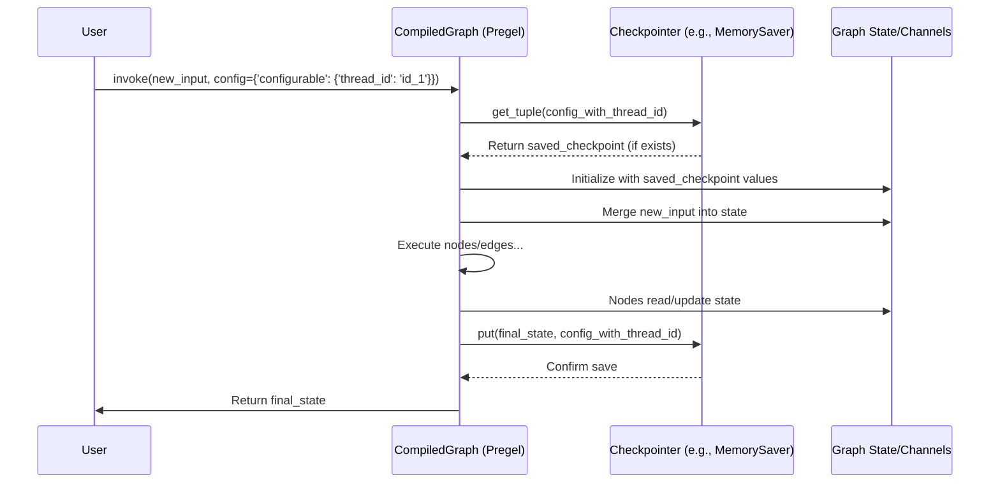

# Chapter 7: Checkpoints

In [Chapter 6: RunnableConfig](06_runnableconfig_.md), we saw how to pass configuration settings like `recursion_limit` and `thread_id` when running our graph. Now, let's uncover why `thread_id` is so important: it's the key to unlocking **Checkpoints**, LangGraph's mechanism for saving and loading the state of your graph.

## What Problem Do Checkpoints Solve? Saving Your Progress

Imagine playing a long video game. You wouldn't want to start from the very beginning every time you play, right? You'd use the game's "Save" feature to store your progress and "Load" it later to continue where you left off.

Long-running AI applications, especially chatbots or agents that interact with humans, have a similar need:

*   **Chatbots:** Need to remember the conversation history across multiple turns, even if the user comes back hours or days later.
*   **Human-in-the-loop:** An AI might need to pause, wait for a human to review something or provide input, and then resume.
*   **Fault Tolerance:** If a complex workflow crashes midway, you might want to resume from the last successful step instead of restarting everything.

**Checkpoints** are LangGraph's "Save/Load" system for your graph's state. They allow you to persist the current state of your graph's execution and restore it later.

## Key Concepts

1.  **Checkpoint:** A snapshot of the graph's current state. This includes the values in all the [State Schema & Channels](02_state_schema___channels_.md) and the progress through the graph execution (which nodes have run, etc.). Think of it as a single saved game file.

2.  **Checkpointer:** The *object* responsible for saving and loading these checkpoints. LangGraph provides different checkpointer backends:
    *   `MemorySaver`: Saves checkpoints in memory (useful for testing or short-lived processes, but data is lost when the program stops).
    *   `SqliteSaver`: Saves checkpoints to a SQLite database file (persistent storage).
    *   Other backends (like `PostgresSaver`, `RedisSaver`) are available for more robust storage.
    *   Think of the checkpointer as the mechanism that reads/writes your saved game files to a memory card or hard drive.

3.  **`thread_id`:** The identifier for a specific conversation or execution run. Passed via [Chapter 6: RunnableConfig](06_runnableconfig_.md), it tells the checkpointer *which* saved game slot to use. Each unique `thread_id` corresponds to an independent history of checkpoints.

4.  **Compilation:** You enable checkpointing by passing a checkpointer object when you `compile()` your graph.

## How to Use It: Making Our Bot Remember

Let's revisit our simple echo bot from [Chapter 1: Graph / StateGraph](01_graph___stategraph_.md) and make it remember the conversation using checkpoints.

**1. Setup (Graph Definition - Recap):**

```python
from typing import Annotated, List
from typing_extensions import TypedDict
from langchain_core.messages import AnyMessage, HumanMessage, AIMessage
from langgraph.graph import StateGraph, END
from langgraph.graph.message import add_messages

# 1. State
class AgentState(TypedDict):
    messages: Annotated[List[AnyMessage], add_messages]

# 2. Node
def echo_node(state: AgentState):
    last_message = state['messages'][-1]
    response = f"Echo: {last_message.content}"
    return {"messages": [("ai", response)]}

# 3. Graph Builder
builder = StateGraph(AgentState)
builder.add_node("echo", echo_node)
builder.set_entry_point("echo")
builder.set_finish_point("echo")
```

*   This is the same simple echo bot structure we've seen before.

**2. Enable Checkpointing during Compilation:**

This is the crucial new step. We create a checkpointer instance (we'll use the simple `MemorySaver` for this example) and pass it to `compile()`.

```python
from langgraph.checkpoint.memory import MemorySaver

# Create a checkpointer (stores checkpoints in memory)
memory_saver = MemorySaver()

# Compile the graph, enabling checkpointing
app = builder.compile(checkpointer=memory_saver)
```

*   `MemorySaver()`: Creates an object that knows how to save/load checkpoints in RAM.
*   `builder.compile(checkpointer=memory_saver)`: We tell LangGraph to use this saver when running the compiled `app`.

**3. Run the Graph with a `thread_id`:**

Now, when we run the graph, we provide a unique `thread_id` in the [Chapter 6: RunnableConfig](06_runnableconfig_.md). This tells the checkpointer which "save slot" to use.

```python
# Configuration for the first run
config_1 = {"configurable": {"thread_id": "my_conversation_1"}}
input_1 = {"messages": [("human", "Hello LangGraph!")]}

# Run the graph - state will be saved under "my_conversation_1"
final_state_1 = app.invoke(input_1, config=config_1)

print("--- First Run Output ---")
print(final_state_1['messages'])
```

*   `config_1`: We define a config dictionary with `configurable` containing our chosen `thread_id`.
*   `app.invoke(..., config=config_1)`: The graph runs. Because a checkpointer and `thread_id` are present, after the run completes, the `MemorySaver` automatically saves the final state `{"messages": [HumanMessage(...), AIMessage(...)]}` associated with `thread_id="my_conversation_1"`.

*Expected Output:*
```
--- First Run Output ---
[HumanMessage(content='Hello LangGraph!', id='...'), AIMessage(content='Echo: Hello LangGraph!', id='...')]
```

**4. Resume the Graph:**

Now, let's simulate the user sending another message in the *same* conversation. We use the **same `thread_id`**.

```python
# Configuration for the second run (SAME thread_id)
config_2 = {"configurable": {"thread_id": "my_conversation_1"}}
# ONLY the new message is needed as input
input_2 = {"messages": [("human", "How are checkpoints?")]}

# Run the graph again for the same thread_id
# LangGraph will automatically load the saved state before running
final_state_2 = app.invoke(input_2, config=config_2)

print("\n--- Second Run Output ---")
print(final_state_2['messages'])
```

*   `config_2`: Crucially, we use the *exact same* `thread_id` ("my_conversation_1").
*   `input_2`: We only provide the *new* message. We don't need to pass the old messages because the checkpointer will load them.
*   `app.invoke(..., config=config_2)`:
    1.  LangGraph sees the `thread_id`.
    2.  It asks the `MemorySaver` to load the last checkpoint for `"my_conversation_1"`.
    3.  The saver returns the state `{"messages": [HumanMessage(...), AIMessage(...)]}` from the first run.
    4.  LangGraph merges the new `input_2` message into the loaded state using `add_messages` (because of our state annotation). The state becomes `{"messages": [HumanMessage(...), AIMessage(...), HumanMessage(...)]}`.
    5.  The `echo_node` runs with this combined state.
    6.  The node returns the new AI message.
    7.  LangGraph merges it: `{"messages": [..., ..., ..., AIMessage(content='Echo: How are checkpoints?')]}`.
    8.  The `MemorySaver` saves this *new* final state for `"my_conversation_1"`, overwriting the previous save for that thread.

*Expected Output:*
```
--- Second Run Output ---
[HumanMessage(content='Hello LangGraph!', id='...'), AIMessage(content='Echo: Hello LangGraph!', id='...'), HumanMessage(content='How are checkpoints?', id='...'), AIMessage(content='Echo: How are checkpoints?', id='...')]
```

Success! The graph remembered the first message because the checkpointer loaded the saved state before the second run.

## How It Works Internally? (A Peek)

Checkpointing integrates seamlessly with the [Pregel Execution Engine](05_pregel_execution_engine_.md) and [RunnableConfig](06_runnableconfig_.md).

**During `compile()`:**
*   The `compile()` method receives the `checkpointer` object (e.g., `MemorySaver`).
*   It stores this checkpointer instance within the compiled graph (`CompiledStateGraph`) object.

**During `invoke()` / `stream()`:**

1.  **Check Config:** The Pregel engine starts and inspects the `config` dictionary passed to `invoke()`.
2.  **Checkpointer Exists?** It checks if the compiled graph has a checkpointer attached.
3.  **`thread_id` Provided?** It looks for `config["configurable"]["thread_id"]`.
4.  **Load Checkpoint (If applicable):** If a checkpointer and `thread_id` are found, Pregel calls the checkpointer's `get_tuple()` method, passing the `config` (which contains the `thread_id`).
5.  **Checkpointer Loads:** The specific checkpointer (e.g., `MemorySaver`) uses the `thread_id` to look up the latest saved checkpoint for that thread. It might query its internal dictionary (for `MemorySaver`) or a database (for `SqliteSaver`). It returns the saved `Checkpoint` object (or `None` if nothing is saved for that ID).
6.  **Initialize State:** Pregel initializes the graph's internal state using the loaded checkpoint's values. If no checkpoint was loaded, it starts with an empty state.
7.  **Merge Input:** Pregel merges the current `input` data into the state (using the channel reducers like `add_messages`).
8.  **Execute Graph:** Pregel runs the graph's nodes and edges as usual ([Chapter 5: Pregel Execution Engine](05_pregel_execution_engine_.md)). Nodes read from and write updates to the state.
9.  **Save Checkpoint:** *After* the graph execution finishes (or is interrupted), if a checkpointer and `thread_id` were used, Pregel calls the checkpointer's `put()` method.
10. **Checkpointer Saves:** It passes the final graph state, the `config` (with `thread_id`), and metadata to the checkpointer. The checkpointer saves this snapshot, associating it with the `thread_id`, usually overwriting the previous checkpoint for that thread.
11. **Return Result:** Pregel returns the final state to the user.

Here's a simplified sequence diagram:



**Code References:**

*   The `compile()` method stores the checkpointer (`graph/state.py`).
*   The core Pregel loop logic in `pregel/loop.py` (`__enter__` / `__aenter__` methods) handles calling `checkpointer.get_tuple()` / `aget_tuple()`.
*   The same loop calls `checkpointer.put()` / `aput()` before exiting (`_put_checkpoint` method which calls the saver).
*   Checkpointer implementations (like `checkpoint/memory.py`, `checkpoint/sqlite.py`) define the actual `get_tuple`/`put` logic for storage.

```python
# Simplified concept from pregel/loop.py SyncPregelLoop.__enter__()

def __enter__(self):
    # ... other setup ...
    if self.checkpointer:
        # Get the last saved checkpoint for the thread_id in self.checkpoint_config
        saved: Optional[CheckpointTuple] = self.checkpointer.get_tuple(self.checkpoint_config)
        if saved is None:
            # If no save exists, start with an empty checkpoint
            saved = CheckpointTuple(self.checkpoint_config, empty_checkpoint(), {"step": -2}, None, [])
        # ... migrate checkpoint if needed ...
        # Load the checkpoint's values and config
        self.checkpoint = saved.checkpoint
        self.checkpoint_config = {**self.checkpoint_config, **saved.config, ...}
        # ...
    else:
        # No checkpointer, start fresh
        self.checkpoint = empty_checkpoint()
        # ...

    # Initialize channels based on loaded/empty checkpoint
    self.channels, self.managed = self.stack.enter_context(
        ChannelsManager(self.specs, self.checkpoint, self)
    )
    # ... rest of setup ...
    return self

# Simplified concept from pregel/loop.py PregelLoop._put_checkpoint()
def _put_checkpoint(self, metadata: CheckpointMetadata):
    # ... determine if checkpointing is needed ...
    do_checkpoint = self._checkpointer_put_after_previous is not None and (...)

    # Create the checkpoint data structure
    self.checkpoint = create_checkpoint(...)

    if do_checkpoint:
        # ... prepare config and metadata ...
        # Call the checkpointer's put method (potentially async/deferred)
        self._put_checkpoint_fut = self.submit(
            self._checkpointer_put_after_previous, # Calls checkpointer.put()
            ..., # previous future
            self.checkpoint_config, # Includes thread_id
            copy_checkpoint(self.checkpoint), # The state snapshot
            metadata,
            new_versions,
        )
        # Update config with the ID of the checkpoint just saved
        self.checkpoint_config = { ... CONFIG_KEY_CHECKPOINT_ID: self.checkpoint["id"] ... }
    # ... increment step ...
```

This integration allows the graph execution engine to automatically handle the persistence layer when configured correctly.

## Conclusion

You've learned about **Checkpoints**, LangGraph's powerful mechanism for saving and resuming graph state.

*   Checkpoints act like **save files** for your graph's execution state.
*   A **Checkpointer** object (like `MemorySaver` or `SqliteSaver`) handles the actual saving and loading.
*   You enable checkpointing by passing a checkpointer during graph `compile()`.
*   You use the `thread_id` in [RunnableConfig](06_runnableconfig_.md) to specify *which* saved history to load and update.
*   This enables persistent conversations, human-in-the-loop workflows, and fault tolerance.

Checkpointing is a cornerstone of building robust, stateful applications with LangGraph.

So far, we've built graphs by explicitly adding nodes and edges using the `StateGraph` builder. Is there a more concise way to define simpler graphs?

**Next:** [Chapter 8: Functional API (@task/@entrypoint)](08_functional_api___task__entrypoint__.md)

---

Generated by [AI Codebase Knowledge Builder](https://github.com/The-Pocket/Tutorial-Codebase-Knowledge)