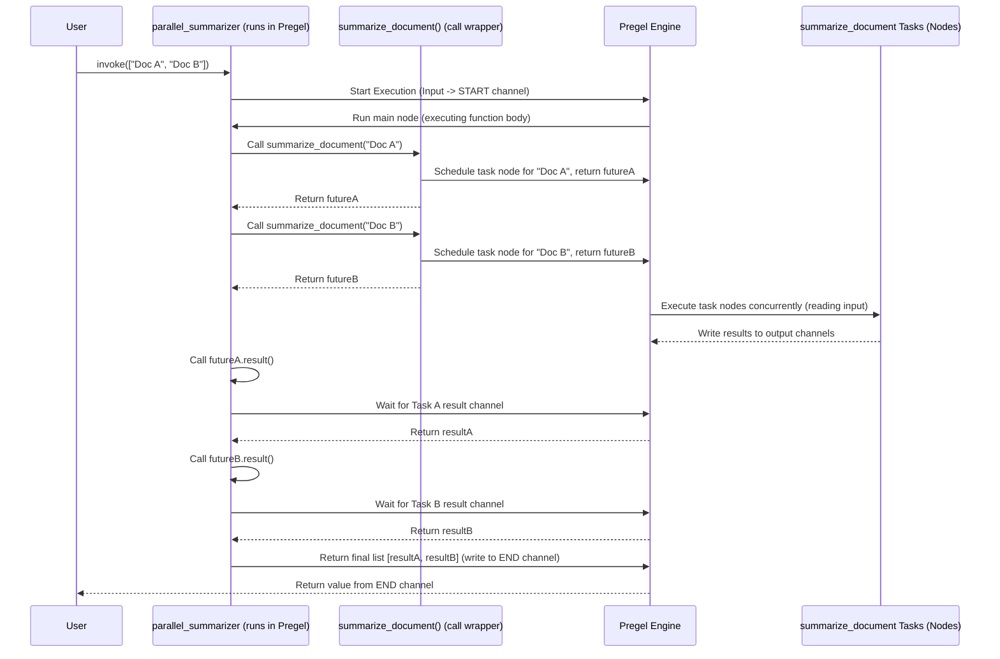

# Chapter 8: Functional API (@task/@entrypoint)

In [Chapter 7: Checkpoints](07_checkpoints_.md), we learned how to save and load our graph's state, making our applications persistent. Throughout the previous chapters, we've built graphs by explicitly defining a state schema, adding nodes with `builder.add_node()`, and connecting them with `builder.add_edge()` or `builder.add_conditional_edges()`.

But what if your workflow is simpler? Maybe you just want to run a few steps in sequence or even in parallel, without worrying too much about the explicit graph structure or managing complex state dictionaries?

That's where the **Functional API** comes in. It offers an alternative, often more concise way to define LangGraph workflows using Python decorators: `@entrypoint` for the main workflow and `@task` for individual steps.

## What Problem Does This Solve? Simpler Graph Definition

Imagine you want to take a list of short documents and generate a summary for *each* one. You'd ideally want to summarize them in parallel to save time. Then, you want to collect all the summaries.

Using `StateGraph` explicitly is certainly possible, but it might feel a bit verbose for this "map-reduce" style pattern (map the summarize function over each document, then reduce by collecting the results).

The Functional API aims to make defining such workflows feel more like writing regular Python functions. It hides some of the explicit graph-building steps behind decorators, compiling to a standard [Pregel Execution Engine](05_pregel_execution_engine_.md) graph internally. Think of it as using higher-level building blocks instead of assembling everything from basic components.

## Key Concepts

1.  **`@task`:**
    *   This decorator marks a regular Python function as an individual unit of work, similar to a [Node](03_nodes_.md) in `StateGraph`.
    *   You write a standard function (sync or async) that takes some input and returns a result.
    *   When you *call* a `@task`-decorated function from within an `@entrypoint` function, it doesn't run immediately. Instead, LangGraph schedules it to run as part of the underlying graph, potentially in parallel with other tasks.
    *   Calling a `@task` function returns a **future** object. This object represents the *promise* of a result that will be available later.
    *   **Analogy:** `@task` defines a specific job description (e.g., "Summarize Document").

2.  **`@entrypoint`:**
    *   This decorator marks the main function that defines your workflow. It's the starting point, similar to how we used `builder.set_entry_point()`.
    *   Inside this function, you call your `@task`-decorated functions.
    *   The `@entrypoint` decorator takes your function and the tasks it calls and automatically compiles them into an executable LangGraph graph (a `Pregel` object).
    *   You can also pass a [Checkpointer](07_checkpoints_.md) to the `@entrypoint` decorator to enable state persistence for the workflow.
    *   **Analogy:** `@entrypoint` is the main blueprint or recipe that orchestrates how and when different jobs (`@task`s) are performed.

3.  **Futures:**
    *   As mentioned, calling a `@task` function gives you a future, not the direct result.
    *   To get the actual result, you need to wait for the future to complete.
        *   For synchronous tasks/entrypoints, you typically call `.result()` on the future object.
        *   For asynchronous tasks/entrypoints (using `async def`), you typically use `await` on the future or tools like `asyncio.gather`.
    *   This future mechanism is what allows LangGraph to potentially run multiple tasks concurrently.

## How to Use It: Parallel Summarization Example

Let's implement our parallel summarization use case.

**1. Define a Task:**

First, we define the function that performs the summarization for a single document. We decorate it with `@task`.

```python
from langgraph.func import task

@task
def summarize_document(document: str) -> str:
    """A simple task to 'summarize' a document."""
    print(f"Task: Summarizing '{document}'")
    # Simulate summarization work
    summary = f"Summary for: {document}"
    return summary
```

*   `@task`: Marks `summarize_document` as a LangGraph task.
*   It's just a regular Python function taking a `document` string and returning a `summary` string.

**2. Define the Entrypoint:**

Next, we define the main workflow function that takes a list of documents, calls the `summarize_document` task for each, and collects the results.

```python
from langgraph.func import entrypoint
# Note: We are using sync functions here for simplicity. Async is also supported.

@entrypoint # No checkpointer needed for this simple example
def parallel_summarizer(documents: list[str]) -> list[str]:
    """Summarizes a list of documents in parallel."""
    print("Entrypoint: Starting parallel summarization")
    summary_futures = []
    # 'Map' step: Call the task for each document
    for doc in documents:
        future = summarize_document(doc) # Returns a future!
        summary_futures.append(future)

    # 'Reduce' step: Collect results from futures
    summaries = [f.result() for f in summary_futures]
    print("Entrypoint: Finished summarization")
    return summaries
```

*   `@entrypoint`: Marks `parallel_summarizer` as the main workflow. LangGraph will compile this function.
*   It takes a list of `documents`.
*   `summarize_document(doc)`: We call our `@task` function. This *doesn't* block; it returns a future immediately and schedules the task.
*   `[f.result() for f in summary_futures]`: We iterate through the list of futures. Calling `.result()` on each future *waits* for that specific task to complete and then returns its result. This effectively gathers all the parallel results.
*   The function returns the list of `summaries`.

**3. Run the Workflow:**

The `@entrypoint` decorator automatically compiles the function into a runnable graph object (similar to what `builder.compile()` does for `StateGraph`). We can directly invoke it.

```python
docs_to_summarize = ["Doc A", "Doc B", "Doc C"]

# Invoke the compiled entrypoint function
final_summaries = parallel_summarizer.invoke(docs_to_summarize)

print("\n--- Final Output ---")
print(final_summaries)
```

*   `parallel_summarizer` (the decorated function) acts like the compiled `app` object we saw in previous chapters.
*   `parallel_summarizer.invoke(docs_to_summarize)`: Runs the workflow.

**Expected Output (Order of "Task:" lines may vary due to parallelism):**

```
Entrypoint: Starting parallel summarization
Task: Summarizing 'Doc A'
Task: Summarizing 'Doc B'
Task: Summarizing 'Doc C'
Entrypoint: Finished summarization

--- Final Output ---
['Summary for: Doc A', 'Summary for: Doc B', 'Summary for: Doc C']
```

It worked! The `@entrypoint` function called the `@task` for each document, likely in parallel, and then collected the results. We defined this map-reduce pattern without explicitly creating nodes or edges.

**Adding Checkpointing:**

If we wanted this workflow to remember state (e.g., using the `previous` injectable parameter described in the `@entrypoint` docstring), we could add a checkpointer:

```python
from langgraph.checkpoint.memory import MemorySaver

@entrypoint(checkpointer=MemorySaver())
def stateful_workflow(input_data: Any, *, previous: Any = None) -> Any:
    # Workflow logic here, potentially using 'previous'
    # ...
    # Example: Call a task
    # result_future = some_task(input_data)
    # result = result_future.result()
    #
    # If you want to save 'result' for the *next* run use entrypoint.final
    # from langgraph.func import entrypoint
    # return entrypoint.final(value=result, save=result)
    #
    # Otherwise, just return the result for this run
    # return result
    pass # Placeholder
```

## How It Works Internally? (A Peek)

While it looks like regular Python, the decorators do some clever work behind the scenes to build and run a Pregel graph.

**High-Level Walkthrough:**

1.  **`@entrypoint` Decorator:** When Python loads your code, the `@entrypoint` decorator runs. It takes the decorated function (`parallel_summarizer`) and creates a `Pregel` object ([Chapter 5: Pregel Execution Engine](05_pregel_execution_engine_.md)).
    *   It sets up default channels like `START` (for input), `END` (for output), and `PREVIOUS` (for state saving with checkpoints).
    *   It creates a main node in the Pregel graph that is configured to run the body of your entrypoint function (`parallel_summarizer`).
    *   Crucially, it prepares the runtime environment so that calls to `@task` functions *inside* the entrypoint function can be intercepted.

2.  **`@task` Decorator:** This decorator wraps your task function (e.g., `summarize_document`) with helper code. The core helper is `call` (from `pregel/call.py`).

3.  **During `invoke()`:**
    *   You call `parallel_summarizer.invoke(...)`. This starts the underlying Pregel engine created by the `@entrypoint`.
    *   The initial input (`docs_to_summarize`) is placed in the `START` channel.
    *   The Pregel engine runs the main node associated with the `parallel_summarizer` function body.
    *   **Interception:** When the line `future = summarize_document(doc)` is executed *inside* the main node's run, the `call` wrapper intercepts it.
    *   **Scheduling:** Instead of executing `summarize_document` directly, `call` tells the Pregel engine: "Please schedule a new, separate task to run the actual `summarize_document` function with `doc` as input. Give me a future representing its eventual result." Pregel uses `ChannelWrite` to schedule this.
    *   **Future Returned:** `call` returns a `SyncAsyncFuture` object back to the `parallel_summarizer` function body. This future is linked to the output channel of the newly scheduled task node.
    *   This happens for each document in the loop. Pregel now has multiple `summarize_document` task nodes scheduled (potentially running concurrently).
    *   **Waiting:** When the code reaches `f.result()`, this tells the Pregel engine: "Wait until the specific task node corresponding to future `f` has finished and written its result to its output channel. Then give me that result."
    *   Pregel waits for each task node to complete and fetches the results from the internal channels.
    *   **Final Return:** Once all results are collected, the `parallel_summarizer` function body finishes, and its final return value (`summaries`) is written to the `END` channel.
    *   The `invoke` call returns the value from the `END` channel.

**Sequence Diagram:**



**Code Dive:**

*   **`@task` (`func/__init__.py`)**:
    *   The decorator wraps the user function `func` using `functools.partial(call, func, ...)`.
    *   The `call` function (`pregel/call.py`) is the key. It gets the current `RunnableConfig` using `get_config()`. The config contains a reference (`config[CONF][CONFIG_KEY_CALL]`) to the Pregel engine's internal method for scheduling tasks.
    *   `call` invokes this internal Pregel method, passing the actual task function and its arguments. This method sets up the necessary `ChannelWrite` instructions for Pregel.
    *   `call` returns a `SyncAsyncFuture` that Pregel will eventually resolve with the task's result.

    ```python
    # Simplified from func/__init__.py
    def task(...):
        # ... setup ...
        def decorator(func):
            # 'call' comes from pregel/call.py
            call_func = functools.partial(call, func, retry=...)
            # ... more setup ...
            return functools.update_wrapper(call_func, func)
        # ... handle decorator arguments ...
        return decorator

    # Simplified from pregel/call.py
    def call(func, args_tuple, *, retry, **kwargs):
        config = get_config()
        # Get the Pregel engine's task scheduling implementation
        impl = config[CONF][CONFIG_KEY_CALL]
        # Ask Pregel to schedule the function and return a future
        fut = impl(func, args_tuple, retry=retry, ...)
        return fut # Returns SyncAsyncFuture
    ```

*   **`@entrypoint` (`func/__init__.py`)**:
    *   The decorator itself (`entrypoint.__call__`) takes the user's workflow function (`func`).
    *   It inspects the function signature to determine input/output types.
    *   It directly creates a `Pregel` instance.
    *   It configures the `Pregel` object:
        *   Sets up `START`, `END`, `PREVIOUS` channels using `EphemeralValue` or `LastValue`.
        *   Creates the main node (`PregelNode`) whose `bound` runnable is the user's entrypoint function (`func`), wrapped appropriately (`get_runnable_for_entrypoint`).
        *   Configures this node to be triggered by `START` and write its output to `END` (and `PREVIOUS` if `entrypoint.final` is used).
        *   Attaches the `checkpointer` if provided.
    *   It returns this configured `Pregel` object, which is the runnable workflow.

    ```python
    # Simplified from func/__init__.py
    class entrypoint:
        # ... __init__ stores checkpointer etc. ...

        def __call__(self, func: Callable[..., Any]) -> Pregel:
            # Wrap the user function into a Runnable
            bound = get_runnable_for_entrypoint(func)
            # Determine input/output types from signature
            input_type = ...
            output_type, save_type = ... # Handles entrypoint.final

            # Create and configure the Pregel graph directly
            return Pregel(
                nodes={
                    func.__name__: PregelNode(
                        bound=bound, # The runnable entrypoint function
                        triggers=[START],
                        channels=[START], # Reads from START
                        writers=[ # Writes result to END/PREVIOUS
                            ChannelWrite(...)
                        ],
                    )
                },
                channels={ # Define channels
                    START: EphemeralValue(input_type),
                    END: LastValue(output_type, END),
                    PREVIOUS: LastValue(save_type, PREVIOUS),
                },
                input_channels=START,
                output_channels=END,
                checkpointer=self.checkpointer,
                # ... other Pregel settings ...
            )
    ```

The Functional API cleverly uses decorators and the existing Pregel machinery to provide a higher-level abstraction for defining workflows.

## Conclusion

You've learned about the **Functional API (`@task` / `@entrypoint`)** in LangGraph, an alternative way to define workflows.

*   It uses **decorators** (`@task` for work units, `@entrypoint` for the main flow) instead of explicit `add_node`/`add_edge` calls.
*   It can feel more like writing standard Python functions, especially for **sequential or parallel (map-reduce)** patterns.
*   Calling `@task` functions returns **futures**, enabling concurrency.
*   It compiles down to a standard `Pregel` graph internally and supports features like [Checkpoints](07_checkpoints_.md).

The Functional API provides a useful abstraction layer on top of LangGraph's core concepts. Whether you choose it or the explicit `StateGraph` approach depends on the complexity of your workflow and your personal preference. Both lead to the same powerful Pregel execution engine running your logic.

This concludes our core LangGraph tutorial! You've journeyed from basic graphs and state to nodes, edges, the execution engine, configuration, checkpoints, and now the functional API. You now have the foundational knowledge to build sophisticated, multi-step LLM applications with LangGraph.

---

Generated by [AI Codebase Knowledge Builder](https://github.com/The-Pocket/Tutorial-Codebase-Knowledge)