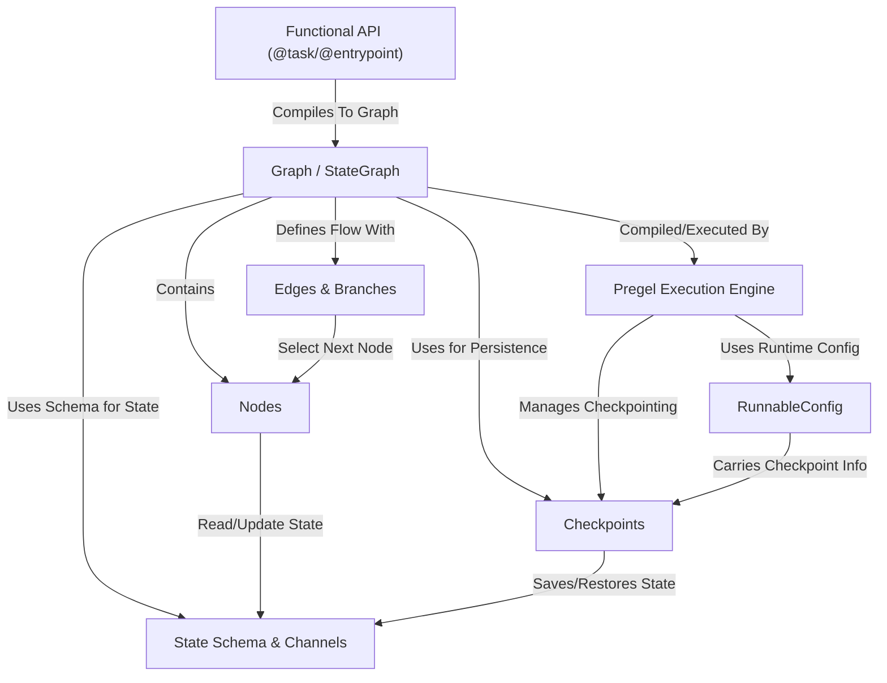

# Tutorial: langgraph

LangGraph helps you build *stateful, multi-step applications*, often used for AI agents or complex workflows.
Think of it like creating a flowchart (**Graph**) where each box (**Node**) performs an action, and the lines (**Edges**) determine the next step.
Crucially, these flows can maintain a shared **State** that nodes can read from and write to, allowing the application to evolve over time.
It provides a **Pregel** execution engine to run these graphs efficiently, supports **Checkpoints** to save and resume progress, and offers a decorator-based **Functional API** for a potentially simpler way to define workflows. **RunnableConfig** is used to pass runtime settings.

**Source Repository:** [None](None)

## Chapters

1. [Graph / StateGraph
](01_graph___stategraph_.md)
2. [State Schema & Channels
](02_state_schema___channels_.md)
3. [Nodes
](03_nodes_.md)
4. [Edges & Branches
](04_edges___branches_.md)
5. [Pregel Execution Engine
](05_pregel_execution_engine_.md)
6. [RunnableConfig
](06_runnableconfig_.md)
7. [Checkpoints
](07_checkpoints_.md)
8. [Functional API (@task/@entrypoint)
](08_functional_api___task__entrypoint__.md)

---

Generated by [AI Codebase Knowledge Builder](https://github.com/The-Pocket/Tutorial-Codebase-Knowledge)